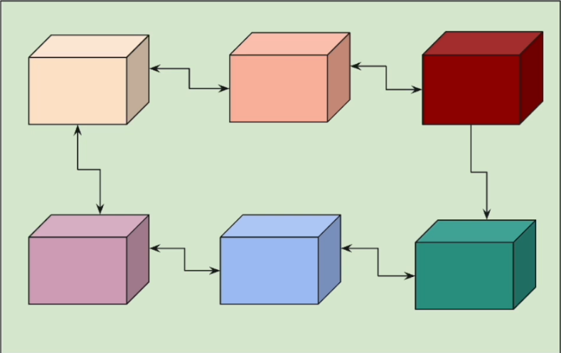

# REACTIVE MICROSERVICES ARCHITECTURE & DESIGN PATTERNS

Del curso de UDEMY: `udemy.com/course/spring-webflux-patterns/`

## Introducción

Para hacer este curso se asume que ya tenemos que saber programación reactiva y usar Spring WebFlux.

Ver mis repositorios:

- `https://github.com/JoseManuelMunozManzano/Mastering-Java-Reactive-Programming`
- `https://github.com/JoseManuelMunozManzano/Spring-WebFlux-Masterclass-Reactive-Microservices`

¿Por qué tenemos la necesidad de conocer patrones de diseño en arquitecturas de microservicios reactivos?

En una arquitectura de microservicios, no solo tenemos un servicio, sino que tenemos muchos servicios trabajando juntos y hablándose los unos a los otros.

El objetivo de este curso es **identificar los problemas de nuestro diseño y corregirlos usando patrones**, particularmente en:

- Integración de servicios.
- Desarrollo de microservicios robustos (resilientes).

**¿Que son los patrones de diseño?**

- Un conjunto de buenas prácticas / soluciones / enfoque estructurado para los problemas de Diseño de Sofware.
- Existen patrones de diseño para OOP / Funcional / Cloud / **Integración** / **Resiliente** / Event Driven Arch.
  - En este curso nos centraremos en los patrones de diseño para Integración y Resiliente.

**Qué vemos en este curso**

Vamos a aprender 10 patrones bajo 2 categorías:

- Integration Patterns
  - Gateway Aggregator Pattern
  - Scatter Gather Pattern
  - Orchestrator Pattern (parallel workflow)
  - Orchestrator Pattern (sequential workflow)
  - Splitter Pattern
- Resilient Patterns
  - Timeout Pattern
  - Retry Pattern
  - Circuit Breaker Pattern
  - Rate Limiter Pattern
  - Bulkhead Pattern

Para cada patrón, se indicará que problema se quiere resolver y como puede ese patrón resolverlo. Luego, implementaremos el patrón y finalmente haremos tests y confirmaremos su comportamiento.