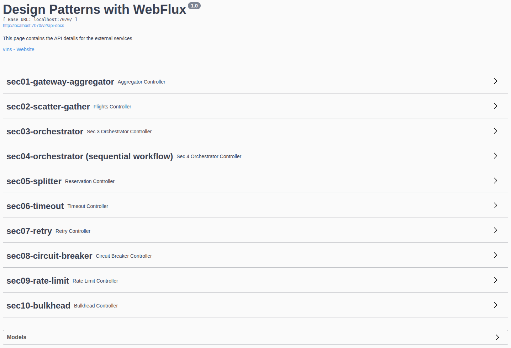

# REACTIVE MICROSERVICES ARCHITECTURE & DESIGN PATTERNS

Del curso de UDEMY: https://www.udemy.com/course/spring-webflux-patterns

## Introducción

Para hacer este curso se asume que ya tenemos que saber programación reactiva y usar Spring WebFlux.

Ver mis repositorios:

- https://github.com/JoseManuelMunozManzano/Mastering-Java-Reactive-Programming
- https://github.com/JoseManuelMunozManzano/Spring-WebFlux-Masterclass-Reactive-Microservices

¿Por qué tenemos la necesidad de conocer patrones de diseño en arquitecturas de microservicios reactivos?

En una arquitectura de microservicios, no solo tenemos un servicio, sino que tenemos muchos servicios trabajando juntos y hablándose los unos a los otros.

El objetivo de este curso es **identificar los problemas de nuestro diseño y corregirlos usando patrones**, particularmente en:

- Integración de servicios.
- Desarrollo de microservicios robustos (resilientes).

**¿Que son los patrones de diseño?**

- Un conjunto de buenas prácticas / soluciones / enfoque estructurado para los problemas de Diseño de Sofware.
- Existen patrones de diseño para OOP / Funcional / Cloud / **Integración** / **Resiliente** / Event Driven Arch.
  - En este curso nos centraremos en los patrones de diseño para Integración y Resiliente.

**Qué vemos en este curso**

Vamos a aprender 10 patrones bajo 2 categorías:

- Integration Patterns
  - Gateway Aggregator Pattern
  - Scatter Gather Pattern
  - Orchestrator Pattern (parallel workflow)
  - Orchestrator Pattern (sequential workflow)
  - Splitter Pattern
- Resilient Patterns
  - Timeout Pattern
  - Retry Pattern
  - Circuit Breaker Pattern
  - Rate Limiter Pattern
  - Bulkhead Pattern

Para cada patrón, se indicará que problema se quiere resolver y como puede ese patrón resolverlo. Luego, implementaremos el patrón y finalmente haremos tests y confirmaremos su comportamiento.

## External Services

En este repositorio tenemos este fuente: `external-services-v2.jar`. Este jar es una aplicación de Spring que simula un conjunto de microservicios externos de terceros con los que tendremos que interaccionar para desarrollar nuestros distintos microservicios del curso.

Para ejecutarlo:

- Ejecutar `java -jar external-services-v2.jar`
    - Por defecto se ejecuta en el puerto 7070, pero se puede cambiar a otro puerto, por ejemplo: `java -jar external-services-v2.jar --server.port=6060`
- Acceder con el navegador a Swagger: http://localhost:7070/swagger-ui/

Veremos esta pantalla:

Es la información sobre los servicios externos con los que tendremos que interaccionar durante este curso.

## Gateway Aggregator Pattern

[README - Gateway Aggregator Pattern](./webflux-patterns/README.md#gateway-aggregator-pattern)

Ver proyecto `webflux-patterns`, paquete `sec01`:

- `client`
    - `ProductClient`: Llamamos a nuestro upstream service.
    - `PromotionClient`: Llamamos a nuestro upstream service.
    - `ReviewClient`: Llamamos a nuestro upstream service.
- `controller`
    - `ProductAggregateController`
- `dto`
    - `ProductResponse`: La respuesta que esperamos del servicio externo `Product Service`.
    - `PromotionResponse`: La respuesta que esperamos del servicio externo `Promotion Service`.
    - `Review`: La respuesta que esperamos del servicio externo `Review Service`.
    - `ProductAggregate`: Es la información agrupada que devolveremos a nuestro cliente.
    - `Price`: Información de precios con cálculos que ya tiene en cuenta promociones.
        - Evitamos que estos cálculos los haga el cliente.
        - El cliente solo se preocupa de la parte de presentación.
- `service`
  - `ProductAggregatorService`

No olvidar, en nuestro main, es decir, en `WebfluxPatternsApplication`, cambiar a `@SpringBootApplication(scanBasePackages = "com.jmunoz.webfluxpatterns.sec01")`.

- `application.properties`: Indicamos ciertas propiedades bajo el comentario `# Aggregator Pattern (sec01)`

## Scatter Gather Pattern

[README - Scatter Gather Pattern](./webflux-patterns/README.md#scatter-gather-pattern)

Ver proyecto `webflux-patterns`, paquete `sec02`:

- `client`
    - `DeltaClient`
    - `JetBlueClient`
    - `FrontierClient` 
- `controller`
    - `FlightsController`
- `dto`
    - `FlightResult`
- `service`
    - `FlightSearchService`

No olvidar, en nuestro main, es decir, en `WebfluxPatternsApplication`, cambiar a `@SpringBootApplication(scanBasePackages = "com.jmunoz.webfluxpatterns.sec02")`.

- `application.properties`: Indicamos ciertas propiedades bajo el comentario `# Scatter Gather Pattern (sec02)`

## Orchestrator Pattern (For Parallel Workflow)

[README - Orchestrator Pattern](./webflux-patterns/README.md#orchestrator-pattern-for-parallel-workflow)

Ver proyecto `webflux-patterns`, paquete `sec03`:

- `client`
    - `ProductClient`
    - `UserClient`
    - `InventoryClient`
    - `ShippingClient`
- `controller`
    - `OrderController`
- `dto`
    - `OrderRequest`: Es la petición que recibe del servicio order.
    - `OrderResponse`: Es la respuesta que devuelve nuestro orquestador al servicio order.
    - `Status`: Es un enum con los valores SUCCESS y FAILED.
    - `Address`: Es la dirección del usuario.
    - `Product`: Es la respuesta del servicio product. No hace falta una clase request porque solo tenemos que indicarle un id.
    - `PaymentRequest`: Es la petición al servicio user para realizar el pago.
    - `PaymentResponse`: Es la respuesta del servicio user.
    - `InventoryRequest`: Es la petición al servicio inventory para ver si hay disponibilidad del producto.
    - `InventoryResponse`: Es la respuesta del servicio inventory.
    - `ShippingRequest`: Es la petición al servicio shipping para realizar el envío del producto.
    - `ShippingResponse`: Es la respuesta del servicio shipping.
    - `OrchestrationRequestContext`: DTO wrapper de referencias de peticiones/respuestas. 
- `service`
    - `Orchestrator`: Clase abstracta.
    - `PaymentOrchestrator`: Implementación de Orchestrator.
    - `InventoryOrchestrator`: Implementación de Orchestrator.
    - `ShippingOrchestrator`: Implementación de Orchestrator.
    - `OrderFulfillmentService`: Responsable de recibir la petición de `order orchestration` y llamar a las implementaciones de `orchestrator` para cumplir la petición, recoger la respuesta y devolvérsela a `order orchestration`.
    - `OrderCancellationService`: Se invoca si queremos cancelar la orden. Es completamente no bloqueante y asíncrono.
    - `OrchestratorService`: Es el servicio principal, el que recibe la petición desde el controller. 
- `util`
    - `OrchestrationUtil`: Crea los objetos request de OrchestrationRequestContext.
    - `DebugUtil`: Utilidad para mostrar logs en consola.

No olvidar, en nuestro main, es decir, en `WebfluxPatternsApplication`, cambiar a `@SpringBootApplication(scanBasePackages = "com.jmunoz.webfluxpatterns.sec03")`.

- `application.properties`: Indicamos ciertas propiedades bajo el comentario `# Orchestrator Pattern (For Parallel Workflow) (sec03)`

## Orchestrator Pattern (For Sequential Workflow)

[README - Orchestrator Pattern](./webflux-patterns/README.md#orchestrator-pattern-for-sequential-workflow)

Ver proyecto `webflux-patterns`, paquete `sec04`:

- `client`
    - `ProductClient`
    - `UserClient`
    - `InventoryClient`
    - `ShippingClient`
- `controller`
    - `OrderController`
- `dto`
    - `OrderRequest`: Es la petición que recibe del servicio order.
    - `OrderResponse`: Es la respuesta que devuelve nuestro orquestador al servicio order.
    - `Status`: Es un enum con los valores SUCCESS y FAILED.
    - `Address`: Es la dirección del usuario.
    - `Product`: Es la respuesta del servicio product. No hace falta una clase request porque solo tenemos que indicarle un id.
    - `PaymentRequest`: Es la petición al servicio user para realizar el pago.
    - `PaymentResponse`: Es la respuesta del servicio user.
    - `InventoryRequest`: Es la petición al servicio inventory para ver si hay disponibilidad del producto.
    - `InventoryResponse`: Es la respuesta del servicio inventory.
    - `ShippingRequest`: Es la petición al servicio shipping para realizar el envío del producto.
    - `ShippingResponse`: Es la respuesta del servicio shipping.
    - `OrchestrationRequestContext`: DTO wrapper de referencias de peticiones/respuestas.
- `service`
    - `Orchestrator`: Clase abstracta.
    - `PaymentOrchestrator`: Implementación de Orchestrator.
    - `InventoryOrchestrator`: Implementación de Orchestrator.
    - `ShippingOrchestrator`: Implementación de Orchestrator.
    - `OrderFulfillmentService`: Realiza las llamadas secuenciales.
    - `OrderCancellationService`: Se invoca si queremos cancelar la orden. Es completamente no bloqueante y asíncrono.
    - `OrchestratorService`: Es el servicio principal, el que recibe la petición desde el controller.
- `util`
    - `OrchestrationUtil`: Crea los objetos request de OrchestrationRequestContext.
    - `DebugUtil`: Utilidad para mostrar logs en consola.
- `exception`
    - `OrderFulfillmentFailure`: Como se ha decidido emitir una señal de error cuando algo no vaya según lo esperado, creamos esta excepción personalizada.

No olvidar, en nuestro main, es decir, en `WebfluxPatternsApplication`, cambiar a `@SpringBootApplication(scanBasePackages = "com.jmunoz.webfluxpatterns.sec04")`.

- `application.properties`: Indicamos ciertas propiedades bajo el comentario `# Orchestrator Pattern (For Sequential Workflow) (sec04)`

## Splitter Pattern

[README - Splitter Pattern](./webflux-patterns/README.md#splitter-pattern)

Ver proyecto `webflux-patterns`, paquete `sec05`:

- `client`
    - `CarClient`
    - `RoomClient`
- `controller`
    - `ReservationController`
- `dto`
    - Peticiones/Respuestas desde nuestro servicio a los servicios superiores (Car Service y Hotel Service)
        - `CarReservationRequest`: Petición de un item individual, aunque el cliente mandará una lista de reservas de coche, o también un Flux.
        - `CarReservationResponse`
        - `RoomReservationRequest`
        - `RoomReservationResponse`
    - Peticiones/Respuestas desde el cliente hasta nuestro servicio (nuestro patrón Splitter)
        - `ReservationType`: Es un enum.
        - `ReservationItemRequest`: El front nos envía una lista de peticiones de items.
        - `ReservationItemResponse`: Respuesta de cada una de las peticiones. Esta respuesta NO se devuelve al cliente.
        - `ReservationResponse`: Objeto wrapper que envuelve las respuestas y al que añadimos un Id del total y el precio total de todos los items, y que devolvemos al cliente.
- `service`
    - `ReservationHandler`: Clase abstracta para gestionar peticiones a servicios externos.
    - `CarReservationHandler`: Implementación de la clase abstracta.
    - `RoomReservationHandler`: Implementación de la clase abstracta.
    - `ReservationService`: Servicio principal al que llama el controller y que gestionará a qué servicio se tiene que llamar.

No olvidar, en nuestro main, es decir, en `WebfluxPatternsApplication`, cambiar a `@SpringBootApplication(scanBasePackages = "com.jmunoz.webfluxpatterns.sec05")`.

- `application.properties`: Indicamos ciertas propiedades bajo el comentario `# Splitter Pattern (sec05)`

## Resiliency Pattern

Comenzamos, a partir de aquí el estudio de patrones de resiliencia.

¿Qué es resiliencia?

- Los sistemas reactivos deben ser responsivos.
- Resilience = Capacidad de respuesta ante fallos, incluso aunque ocurra algo inesperado.

¿Cómo puede mi sistema ser resiliente si depende de un servicio que no responde? Si el servicio del que dependo no responde, en vez de propagar el error, vamos a asumir unos valores por defecto, o unos valores previamente cacheados, algo que podamos devolver.

## Timeout Pattern

[README - Timeout Pattern](./webflux-patterns/README.md#timeout-pattern)

Ver proyecto `webflux-patterns`, paquete `sec06`:

En `src/java/com/jmunoz/webfluxpatterns/sec06` creamos los paquetes/clases siguientes:

- `client`
    - `ProductClient`: Llamamos a nuestro upstream service. Aquí es donde aplicamos el patrón Timeout.
    - `ReviewClient`: Llamamos a nuestro upstream service. Aquí es donde aplicamos el patrón Timeout.
- `controller`
    - `ProductAggregateController`
- `dto`
    - `Product`: La respuesta que esperamos del servicio externo `Product Service`.
    - `Review`: La respuesta que esperamos del servicio externo `Review Service`.
    - `ProductAggregate`: Es la información agrupada que devolveremos a nuestro cliente.
- `service`
    - `ProductAggregatorService`

No olvidar, en nuestro main, es decir, en `WebfluxPatternsApplication`, cambiar a `@SpringBootApplication(scanBasePackages = "com.jmunoz.webfluxpatterns.sec06")`.

- `application.properties`: Indicamos ciertas propiedades bajo el comentario `# Timeout Pattern (sec06)`

## Retry Pattern

[README - Retry Pattern](./webflux-patterns/README.md#retry-pattern)

Ver proyecto `webflux-patterns`, paquete `sec07`:

- `client`
    - `ProductClient`: Llamamos a nuestro upstream service.
    - `ReviewClient`: Llamamos a nuestro upstream service. Aplicamos el patron Retry.
      - No reintenta si hay errores 4XX y se reintenta 5 veces o hasta un tiempo máximo (timeout) de 300 ms.
- `controller`
    - `ProductAggregateController`
- `dto`
    - `Product`: La respuesta que esperamos del servicio externo `Product Service`.
    - `Review`: La respuesta que esperamos del servicio externo `Review Service`.
    - `ProductAggregate`: Es la información agrupada que devolveremos a nuestro cliente.
- `service`
    - `ProductAggregatorService`

No olvidar, en nuestro main, es decir, en `WebfluxPatternsApplication`, cambiar a `@SpringBootApplication(scanBasePackages = "com.jmunoz.webfluxpatterns.sec07")`.

- `application.properties`: Indicamos ciertas propiedades bajo el comentario `# Retry Pattern (sec07)`

## Circuit Breaker Pattern

[README - Circuit Breaker Pattern](./webflux-patterns/README.md#circuit-breaker-pattern)

Ver proyecto `webflux-patterns`, paquete `sec08`:

- `client`
    - `ProductClient`: Llamamos a nuestro upstream service.
    - `ReviewClient`: Llamamos a nuestro upstream service. Añadimos la implementación de `Circuit Breaker`.
- `controller`
    - `ProductAggregateController`
- `dto`
    - `Product`: La respuesta que esperamos del servicio externo `Product Service`.
    - `Review`: La respuesta que esperamos del servicio externo `Review Service`.
    - `ProductAggregate`: Es la información agrupada que devolveremos a nuestro cliente.
- `service`
    - `ProductAggregatorService`
- `config`
    - `CircuitBreakerConfig`: Clase de configuración que sobreescribe la configuración de Circuit Breaker que tenemos en application.yaml.

No olvidar, en nuestro main, es decir, en `WebfluxPatternsApplication`, cambiar a `@SpringBootApplication(scanBasePackages = "com.jmunoz.webfluxpatterns.sec08")`.

- `application.properties`: Indicamos ciertas propiedades bajo el comentario `# Circuit Breaker Pattern (sec08)`
- `application.yaml`: Indicamos la configuración de `Resilience4j` para nuestro `Circuit Breaker`.

## Rate Limiter Pattern

[README - Rate Limiter Pattern](./webflux-patterns/README.md#rate-limiter-pattern)

Ver proyecto `webflux-patterns`, paquete `sec09`:

- `client`
    - `ProductClient`: Llamamos a nuestro upstream service.
    - `ReviewClient`: Llamamos a nuestro upstream service y añadimos `client side rate limiter`.
- `controller`
    - `ProductAggregateController`
    - `CalculatorController`: Hacemos este controller para demostrar como funciona `server side rate limiter`.
- `dto`
    - `Product`: La respuesta que esperamos del servicio externo `Product Service`.
    - `Review`: La respuesta que esperamos del servicio externo `Review Service`.
    - `ProductAggregate`: Es la información agrupada que devolveremos a nuestro cliente.
- `service`
    - `ProductAggregatorService`

No olvidar, en nuestro main, es decir, en `WebfluxPatternsApplication`, cambiar a `@SpringBootApplication(scanBasePackages = "com.jmunoz.webfluxpatterns.sec09")`.

- `application.properties`: Indicamos ciertas propiedades bajo el comentario `# Rate Limiter Pattern (sec09)`
- `application.yaml`: Añadimos la configuración de `Resilience4j` para `Server Side Rate Limiter` y `Client Side Rate Limiter`.

## Bulkhead Pattern

[README - Bulkhead Pattern](./webflux-patterns/README.md#bulkhead-pattern)

Ver proyecto `webflux-patterns`, paquete `sec10`:

- `client`
    - `ProductClient`: Llamamos a nuestro upstream service.
    - `ReviewClient`: Llamamos a nuestro upstream service.
- `controller`
    - `ProductAggregateController`: Llamadas de red (IO).
    - `FibController`: Uso intensivo de CPU. Lo corregimos usando lo que ya trae Reactor (Schedulers).
      - La diferencia entre Bulkhead y Rate Limiter es que Bulkhead indica el máximo de llamadas en paralelo que pueden hacerse a la vez y el resto las añade a la cola, y Rate Limiter limita las llamadas que pueden hacerse a una API en una ventana de x segundos y el resto la rechaza.
- `dto`
    - `Product`: La respuesta que esperamos del servicio externo `Product Service`.
    - `Review`: La respuesta que esperamos del servicio externo `Review Service`.
    - `ProductAggregate`: Es la información agrupada que devolveremos a nuestro cliente.
- `service`
    - `ProductAggregatorService`

En `src/test/java/com/jmunoz/webfluxpatterns` creamos las clases siguientes:

- `BulkheadTest`: Envia peticiones concurrentes para obtener el número de fibonacci (CPU intensivo) como información de un producto.

No olvidar, en nuestro main, es decir, en `WebfluxPatternsApplication`, cambiar a `@SpringBootApplication(scanBasePackages = "com.jmunoz.webfluxpatterns.sec10")`.

- `application.properties`: Indicamos ciertas propiedades bajo el comentario `# Bulkhead Pattern (sec10)`