# REACTIVE MICROSERVICES ARCHITECTURE & DESIGN PATTERNS

## Project webfluxpatterns

Para crear el proyecto accederemos a `https://start.spring.io/` e indicaremos estos datos:

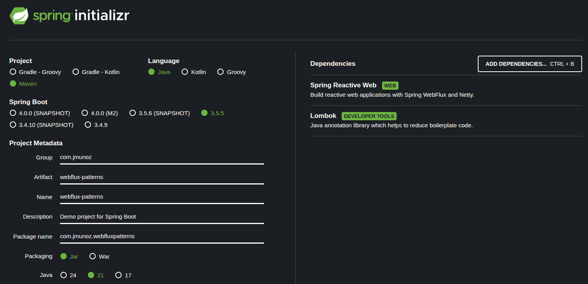

## Gateway Aggregator Pattern

**¿Qué problema trata de resolver?**

Consideremos una aplicación en la que tenemos un montón de servicios como esta:

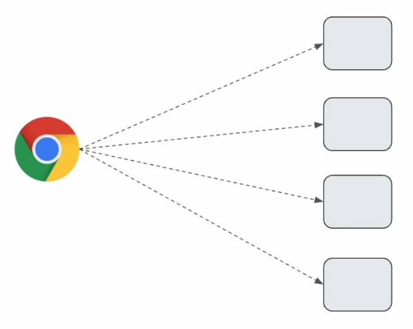

La aplicación cliente (o el navegador) tiene que obtener información de todos esos servicios backend para hacer su trabajo o construir una página.

Los problemas de este enfoque son los siguientes:

- El navegador o aplicación cliente tiene que hacer muchas llamadas por red.
- Los navegadores tienen un límite de llamadas a la vez (paralelas) a un dominio, por ejemplo, Chrome tiene un límite de 6. ¿Qué pasa si tiene que hacer 8 llamadas a servicios? Chrome hará primero 6 llamadas y una vez que cualquiera de las llamadas se complete, usará ese espacio para hacer las llamadas pendientes.
- Incremento de latencia. Imaginemos que los servidores están en USA y el cliente en Europa. Cada petición tendrá su latencia.
- Lógica de agregación compleja en el frontend. ¿Qué pasa si tenemos que añadir una característica extra introduciendo un servicio más? Tenemos que manejar esa lógica en el cliente además de la ya existente, es decir, se añade una complejidad extra.

Aquí es donde entra el patrón Agregador:

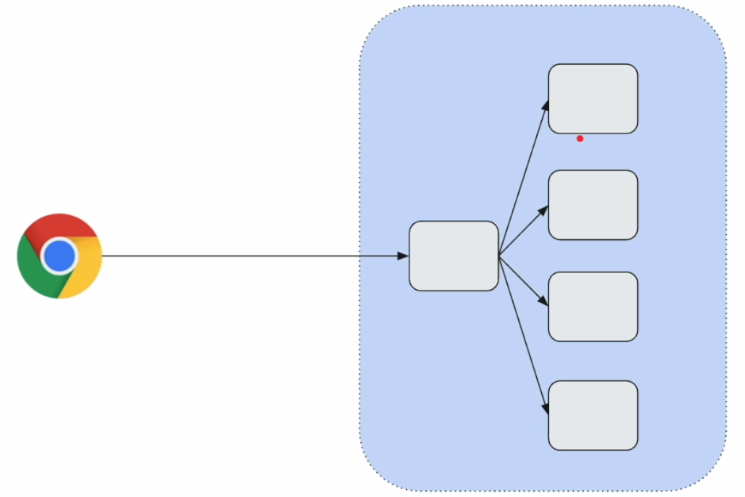

El agregador es un microservicio separado cuyo trabajo es recibir las peticiones del cliente y llamar a los servicios ascendentes, recopilar la información y devolverla al cliente. Así, escode toda la complejidad del backend.

En otras palabras, actúa como un patrón Proxy o Facade.

Desde el punto de vista del cliente, solo existe una llamada, así **el cliente solo tiene que preocuparse de la lógica de presentación**.

Si tenemos que añadir una nueva característica, o tenemos que introducir uno o más microservicios, podemos asumir con seguridad que cada agregador tomará las responsabilidad de obtener la información e incluirla en la respuesta.

Consideremos esta página de detalle de producto de Amazon:


Aquí podemos ver muchísima información sobre el producto, como el título, ratings, preguntas y respuestas, precio, ofertas promocionales, etc. Estoy seguro que no se obtiene toda esta información de un único servicio. Existirá un `productService` que contiene información del producto como el título, habrá un `pricingService`, `reviewService`, `promotionService`, etc.

Pero la página que se muestra actúa como un dashboard, combinando toda esta información proveniente de varias fuentes en una respuesta.

**Product Details Page**

Vamos a hacer un agregador parecido a la página de Amazon (parte backend).

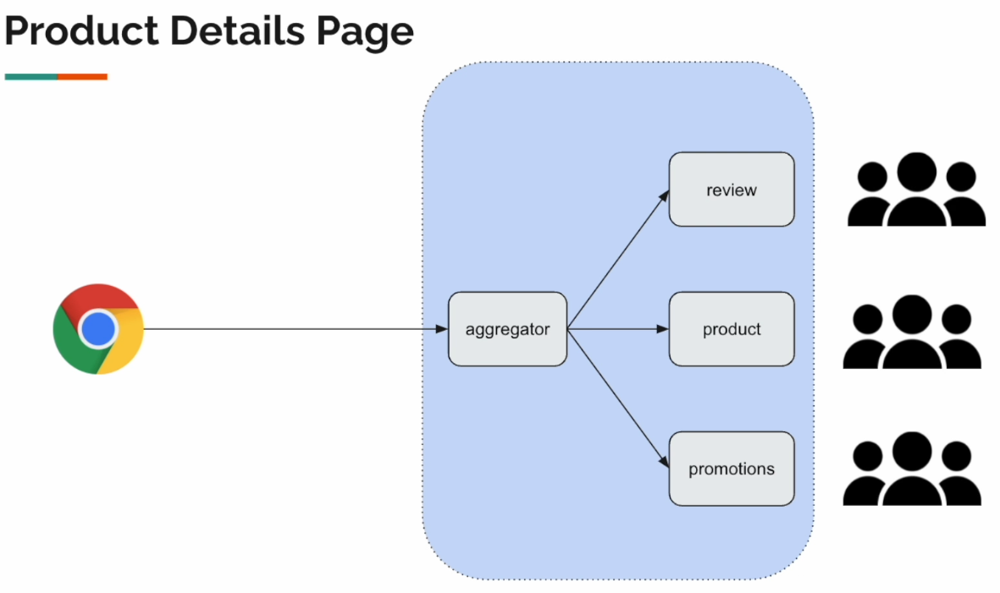

Asumamos que somos parte de una organización en la que hay muchos equipos. Un equipo desarrolla la información de producto, otro las reviews, otro los detalles de las promociones, etc.

La parte del agregador la hace nuestro equipo, así que es lo que vamos a desarrollar en esta sección.

### External Services

Para nuestras clases del patrón Agregador, tenemos que interaccionar con estos tres servicios externos:

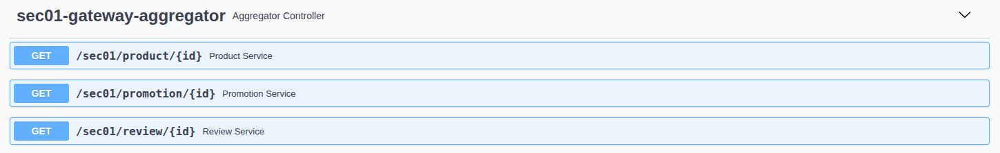

- Product Service
    - Provee detalles de productos para un productId (desde id 1 hasta id 50).
- Promotion Service
    - Los productId 5, 10, 15, 20, 25, 30, 35, 40, 45, 50 no se encuentran en este servicio.
- Review Service
    - Los productId 10, 20, 30, 40, 50 no se encuentran en este servicio. El productId 7 tiene errores extraños.

La data obtenida es aleatoria y varía de una ejecución a otra para un mismo id.

En la vida real, cada uno de estos endpoints sería un servicio jar distinto, y tendríamos que escuchar en diferentes puertos. Pero para mantenerlo simple para este curso, se han combinado todos los servicios en un único jar, aunque a nivel de estudio, los vamos a tratar como servicios distintos.

Nuestro trabajo es desarrollar el servicio `aggregator`:

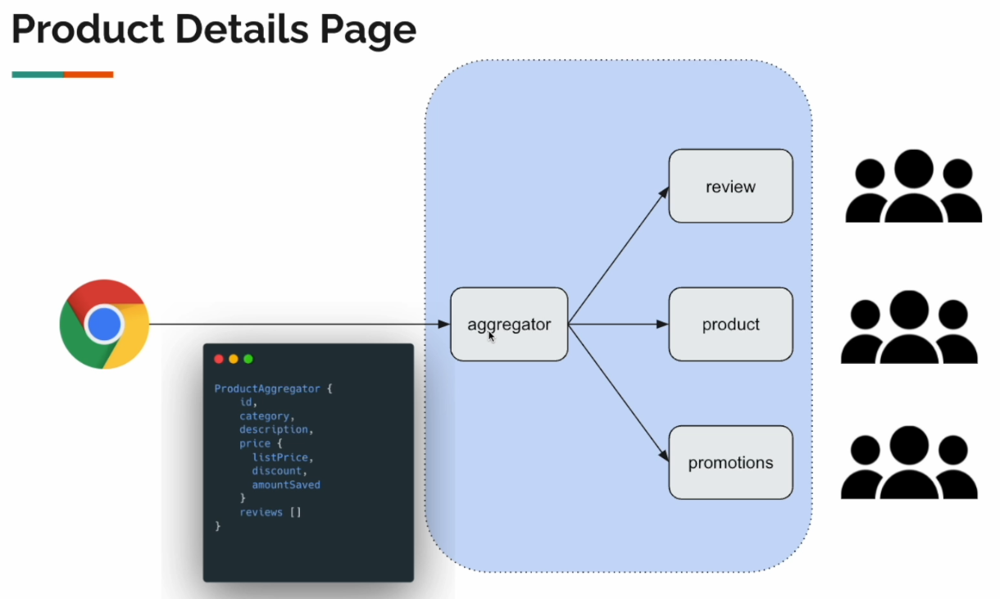

El cliente nos envía una petición, por ejemplo, dame la información del producto 1. Nuestra misión es llamar a todos esos servicios externos y devolveremos la respuesta que se ve en la imagen al cliente, con ese formato. Con esto, el cliente solo se tiene que preocupar de la lógica de presentación.

### Project Setup

En `src/java/com/jmunoz/webfluxpatterns/sec01` creamos los paquetes siguientes:

- `client`
- `controller`
- `dto`
- `service`

### Creating DTO

Creamos las clases DTO que necesitamos para obtener las respuestas de los servicios externos, una clase de precios y otra con la información agrupada que devolveremos a nuestro cliente.

En `src/java/com/jmunoz/webfluxpatterns/sec01` creamos las siguientes clases:

- `dto`
  - `ProductResponse`: La respuesta que esperamos del servicio externo `Product Service`.
  - `PromotionResponse`: La respuesta que esperamos del servicio externo `Promotion Service`.
  - `Review`: La respuesta que esperamos del servicio externo `Review Service`.
  - `ProductAggregate`: Es la información agrupada que devolveremos a nuestro cliente.
  - `Price`: Información de precios con cálculos que ya tiene en cuenta promociones.
    - Evitamos que estos cálculos los haga el cliente.
    - El cliente solo se preocupa de la parte de presentación.

### Creating External Service Client

En `src/java/com/jmunoz/webfluxpatterns/sec01` creamos las siguientes clases:

- `client`
  - `ProductClient`: Llamamos a nuestro upstream service.
  - `PromotionClient`: Llamamos a nuestro upstream service.
  - `ReviewClient`: Llamamos a nuestro upstream service.

### Aggregator Service

Vamos a trabajar en la capa de servicio, para responder a lo que quiere nuestro cliente.

Nuestro servicio Aggregator sabrá a qué servicios tiene que llamar y que responden, gracias a nuestros DTOs y los service clients que ya hemos construido.

Para llamar a más de un publisher y que nos devuelvan sus resultados, usaremos el operador `zip()`.

Usamos ese operador porque las llamadas no son secuenciales. 

**NO VAMOS A HACER ESTO:** Llamamos a un servicio, por ejemplo, el de review, y esperaremos sus resultados. Luego llamamos al servicio de producto y esperamos sus resultados y por último llamamos al servicio de promociones y esperamos sus resultados. Esto afecta al rendimiento.

Con `zip()` haremos todas las llamadas en paralelo y obtendremos las respuestas de manera no bloqueante, daremos esas respuestas a nuestro aggregator service, las ensamblaremos y las devolveremos al cliente.

En `src/java/com/jmunoz/webfluxpatterns/sec01` creamos las siguientes clases:

- `service`
  - `ProductAggregatorService`

### Aggregator Controller

En `src/java/com/jmunoz/webfluxpatterns/sec01` creamos las siguientes clases:

- `controller`
  - `ProductAggregateController`

- `application.properties`: Indicamos ciertas propiedades bajo el comentario `# Aggregator Pattern (sec01)`

### Gateway Aggregator Pattern Demo

- Ejecutamos nuestro servicio externo: `java -jar external-services-v2.jar`.
- `WebfluxPatternsApplication`: Indicamos `@SpringBootApplication(scanBasePackages = "com.jmunoz.webfluxpatterns.sec01")` y ejecutamos.
- Accedemos al navegador, a la url siguiente: http://localhost:8080/sec01/product/2

El resultado esperado es este:

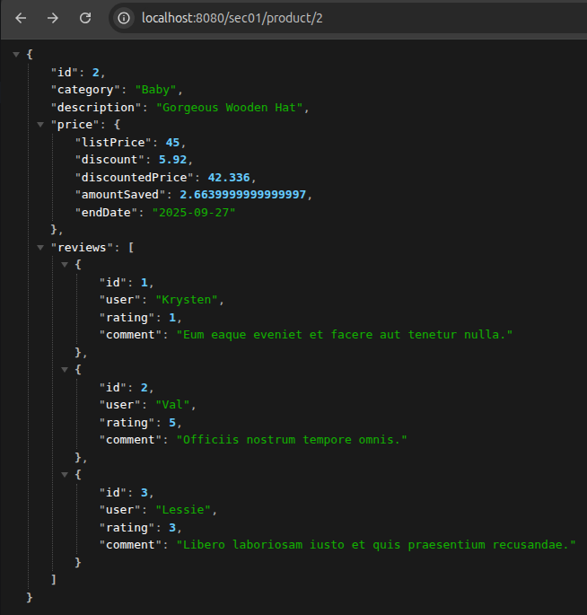

### Is our Aggregator resilient?

Vimos en la clase anterior que todo funcionó bien, pero ¿seguro que nuestro servicio funciona bien?

Si ejecutamos en el navegador esta prueba: http://localhost:8080/sec01/product/85 veremos el siguiente error:

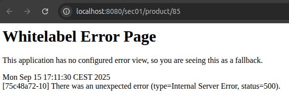

Y en los logs vemos:

```
org.springframework.web.reactive.function.client.WebClientResponseException$NotFound: 404 Not Found from GET http://localhost:7070/sec01/product/85
	at org.springframework.web.reactive.function.client.WebClientResponseException.create(WebClientResponseException.java:324) ~[spring-webflux-6.2.10.jar:6.2.10]
	Suppressed: reactor.core.publisher.FluxOnAssembly$OnAssemblyException: 
Error has been observed at the following site(s):
	*__checkpoint ⇢ 404 NOT_FOUND from GET http://localhost:7070/sec01/product/85 [DefaultWebClient]
	*__checkpoint ⇢ Handler com.jmunoz.webfluxpatterns.sec01.controller.ProductAggregateController#getProductAggregate(Integer) [DispatcherHandler]
	*__checkpoint ⇢ HTTP GET "/sec01/product/85" [ExceptionHandlingWebHandler]
```

Nos indica un error 404 al obtener el producto 85.

Para la url http://localhost:8080/sec01/product/7 también obtenemos un error

```
org.springframework.web.reactive.function.client.WebClientResponseException$InternalServerError: 500 Internal Server Error from GET http://localhost:7070/sec01/review/7
	at org.springframework.web.reactive.function.client.WebClientResponseException.create(WebClientResponseException.java:332) ~[spring-webflux-6.2.10.jar:6.2.10]
	Suppressed: reactor.core.publisher.FluxOnAssembly$OnAssemblyException: 
Error has been observed at the following site(s):
	*__checkpoint ⇢ 500 INTERNAL_SERVER_ERROR from GET http://localhost:7070/sec01/review/7 [DefaultWebClient]
	*__checkpoint ⇢ Handler com.jmunoz.webfluxpatterns.sec01.controller.ProductAggregateController#getProductAggregate(Integer) [DispatcherHandler]
	*__checkpoint ⇢ HTTP GET "/sec01/product/7" [ExceptionHandlingWebHandler]
```

En este caso un error 500 al obtener la review 7.

Vemos que si algún servicio falla, falla todo. Vamos a corregir esto.

### Making Aggregator more resilient!

Hemos encontrado algunos problemas en nuestro servicio Aggregator. Primero tenemos que entender las razones tras estos problemas.

El operador `zip()` recolecta todos los items de los servicios publishers externos y los da como una tupla. Para que el operador `zip()` funcione, todos los publishers tienen que emitir su data.

Si un publisher falla, `zip()` emitirá la señal de error al subscriber (nuestro servicio Aggregator).

Es decir `zip()` es todo o nada.


El servicio Product es el principal. Es bueno tener las promociones y las reviews, pero si fallan con error 500 no debería dar error, y deberíamos poder construir la respuesta.

Si algo falla en el servicio de reviews o de promociones, vamos a suponer que no habían.

De esta forma, podemos hacer nuestro servicio más resiliente.

En `src/java/com/jmunoz/webfluxpatterns/sec01` corregimos las siguientes clases:

- `client`
    - `PromotionClient`: Lo hacemos más resiliente. Si ocurre algún error, suponemos que no hay promociones.
    - `ReviewClient`: Lo hacemos más resiliente. Si ocurre algún error, suponemos que no hay reviews.

Hacemos ahora las mismas pruebas:

- http://localhost:8080/sec01/product/5
  - No hay descuentos, pero funciona.
- http://localhost:8080/sec01/product/7
  - Hay un error extraño en las reviews, pero funciona porque devuelve una lista vacía de reviews.
- http://localhost:8080/sec01/product/85
  - Sigue sin funcionar porque el id no existe. Lo vemos más adelante.

Si en `application.properties` simulamos que el servicio de reviews está caído, asignando otro puerto a `sec01.review.service` y volvemos a ejecutar nuestra app, veremos que seguimos funcionando y que se devuelve una lista de reviews vacía.

Esto es resiliencia.

### Are we making parallel calls?

Vamos a hacer tests rápidos a nuestro servicio Aggregator.

¿Está haciendo realmente todas esas llamadas en paralelo? Para probar esto, al ejecutar nuestro servicio externo, vamos a incluir una propiedad para retrasar la respuesta y simular que nuestro servicio externo es lento.

- Ejecutamos nuestro servicio externo con un delay de 3sg por endpoint: `java -jar external-services-v2.jar --sec01.delay.response=3000`.
- `WebfluxPatternsApplication`: Indicamos `@SpringBootApplication(scanBasePackages = "com.jmunoz.webfluxpatterns.sec01")` y ejecutamos.
- Accedemos al navegador, a la url siguiente: http://localhost:8080/sec01/product/2

Si fuera secuencial, las tres llamadas nos tomarían 9sg, pero NO LO ES, ES PARALELO Y TARDA 3sg.

### Product Service error handling

Hemos visto que si ejecutamos esta url en el navegador: http://localhost:8080/sec01/product/85, seguimos teniendo un error 500, porque ese producto no existe.

Product Service es el servicio principal, tiene que funcionar. Si este servicio ha caído o no es accesible, no vamos a poder construir la respuesta a nuestro cliente.

Sin embargo, si ocurre un error en Product Service, tenemos que manejarlo para que no falle nuestro servicio Aggregator.

En `src/java/com/jmunoz/webfluxpatterns/sec01` corregimos las siguientes clases:

- `client`
    - `ProductClient`: Si se emite la señal de error, devolvemos empty.

**Funcionamiento**

- `ProductClient` emite la señal de error y devuelve empty.
- `ProductAggregatorService`: Como zip() recibe una señal empty devuelve la señal empty.
- `ProductAggregateController`: Como hemos recibido empty, no hay producto, así que devolvemos error 404 (notFound()).

Así se gestiona correctamente la excepción, devolviendo 404 en vez de 500.

Con esta respuesta, el cliente puede hacer una redirección a la página 404, o lo que sea.

## Scatter Gather Pattern

**¿Qué problema trata de resolver?**

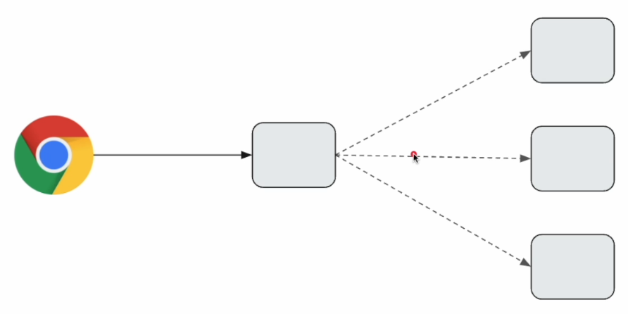

En este patrón tendremos un servicio y recibiremos una petición del cliente. Ese servicio llamará a todos los servicios siguientes y recolectará (gather) los resultados y responderá al cliente.

A primera vista parece igual que `Gateway Aggregator Pattern`, y es parecido, pero con un caso de uso específico:

- ~aggregator
- Transmite el mensaje a todos los destinatarios (no tiene por qué ser exactamente el mismo) y luego recoge la respuesta.
- Casos de uso:
  - Buscar datos desde múltiples fuentes.
  - Dividir el trabajo y hacer procesamiento paralelo.


Consideremos una aplicación de reserva de vuelos, algo como Google Flights, Kayak o algo así. El usuario introduce un origen y un destino y pulsa el botón para buscar vuelos.

La aplicación recibe la petición y actuará como un agente de viajes. Transmite a todos los servicios, Frontier, Delta y United, preguntando si tienen vuelos para este origen y destino, y que le envíen los detalles. Recoge todos los resultados y los devuelve a un cliente, para que seleccione el más barato, o el que sea.

El nombre Scatter indica que dispersa la petición a todos los demás servicios y recoge las respuestas.

Para entender por completo la diferencia entre `Gateway Aggregator Pattern` y `Scatter Gather Pattern` ver esta imagen:

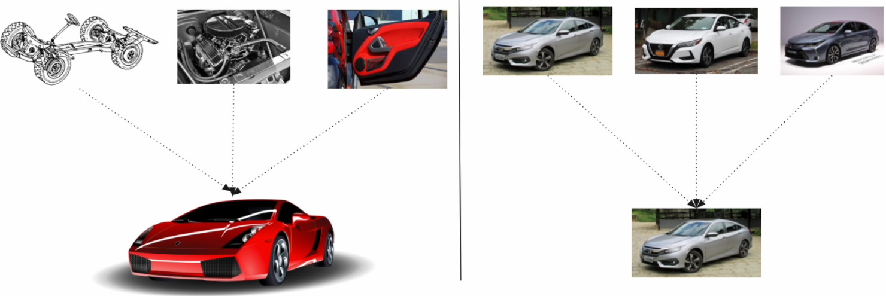

La parte izquierda corresponde al `Gateway Aggregator Pattern`. Lo que hacemos es pedir a los servicios las diferentes partes de las que consta el coche para poder ensamblarlo.

La parte derecha corresponde al `Scatter Gather Pattern`. Lo que hacemos es preguntar a los distintos servicios si tiene el coche, para que se lo envíen. Entonces elegirá el mejor, el más barato, o los recogerá todos.

### External Services

Para nuestras clases del patrón Scatter, tenemos que interaccionar con estos tres servicios externos:

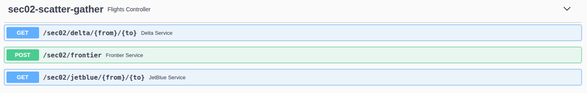

- Delta Service
    - No hay validaciones de from / to. Hay errores ocasionales (para realizar el manejo de excepciones)
    - El tipo de respuesta es text/event-stream
    - Probar indicando from = ATL y to = LAS
    - Probar en un navegador usando la URL siguiente: http://localhost:7070/sec02/delta/ATL/LAS para ver el resultado en formato streaming.
- Frontier Service
    - Solo acepta peticiones POST. No hay validaciones de from / to. Hay errores ocasionales (para realizar el manejo de excepciones)
    - El tipo de respuesta es text/event-stream
    - Probar indicando `{ "from": "ATL", "to": "LAS" }` 
- Jetblue Service
    - No hay validaciones de from / to. Hay errores ocasionales (para realizar el manejo de excepciones)
    - El tipo de respuesta es text/event-stream 
    - Probar indicando from = ATL y to = LAS

Tenemos tres servicios diferentes de aerolíneas. Una es Delta, la otra Frontier y la última es Jetblue. Cada uno de esos servicios devuelve distinta data.

Nuestra misión es ocultar estas complejidades usando un patrón Scatter Gather.

### Creating DTO

Creamos las clases DTO que necesitamos para obtener las respuestas de los servicios externos.

En `src/java/com/jmunoz/webfluxpatterns/sec02` creamos los paquetes/clases siguientes:

- `client`
- `controller`
- `dto`
  - `FlightResult`
- `service`

### Creating Delta Service Client

En `src/java/com/jmunoz/webfluxpatterns/sec02` creamos las clases siguientes:

- `client`
  - `DeltaClient`

### Creating JetBlue / Frontier Service Client

En `src/java/com/jmunoz/webfluxpatterns/sec02` creamos las clases siguientes:

- `client`
  - `JetBlueClient`
  - `FrontierClient`

### Creating Service

En `src/java/com/jmunoz/webfluxpatterns/sec02` creamos las clases siguientes:

- `service`
  - `FlightSearchService`

### Creating Controller

En `src/java/com/jmunoz/webfluxpatterns/sec02` creamos las clases siguientes:

- `controller`
  - `FlightsController`

No olvidar, en nuestro main, es decir, en `WebfluxPatternsApplication`, cambiar a `@SpringBootApplication(scanBasePackages = "com.jmunoz.webfluxpatterns.sec02")`.

- `application.properties`

```
sec02.delta.service=http://localhost:7070/sec02/delta/
sec02.frontier.service=http://localhost:7070/sec02/frontier/
sec02.jetblue.service=http://localhost:7070/sec02/jetblue/
```

### Scatter Gather Demo

- No olvidar ejecutar nuestro servicio externo.
- Ejecutar la app.
- Abrimos un navegador y vamos a la ruta: http://localhost:8080/sec02/flights/ATL/LAS

## Orchestrator Pattern (For Parallel Workflow)

### Introduction

- Aggregator + lógica de negocio adicional para proveer un flujo de trabajo o controlar el flujo de ejecución.

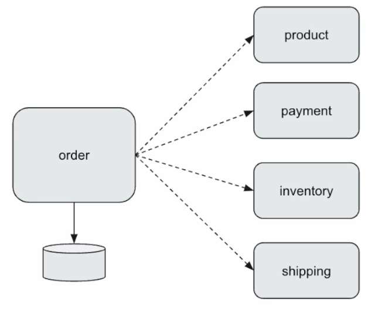

Consideremos una aplicación de ingresos en la que tenemos servicios de producto, pago, inventario y envío. Todos esos servicios tienen su propio CRUD API e individualmente todos funcionan bien.

Para realizar una orden de manera exitosa, recibimos una petición a nuestro servicio Order y este enviará una petición a cada servicio y todos deben terminar correctamente.

Es decir, si recibimos una petición de un producto, este tiene que existir, el usuario debe tener suficiente saldo, el producto debe estar disponible en el inventario y el servicio de envío debe estar listo para poder enviar el producto.

Si todo se cumple, la orden es exitosa. En caso contrario, la orden falla.

Si la orden falla, no podemos sencillamente indicar al usuario que la orden ha fallado. Imaginemos que falla el servicio de inventario porque no hay disponibilidad de ese producto. Tenemos que devolver el dinero al usuario, porque ya lo hemos cobrado.

Esto significa que hay mucho ir y venir de comunicaciones entre los servicios.

En la vida real, el servicio order tendrá sus propias operaciones CRUD y sus correspondientes APIs, como `getOrder()`, `postOrder()`, etc. Así que acomodar esta coordinación adicional entre los servicios es demasiado trabajo.

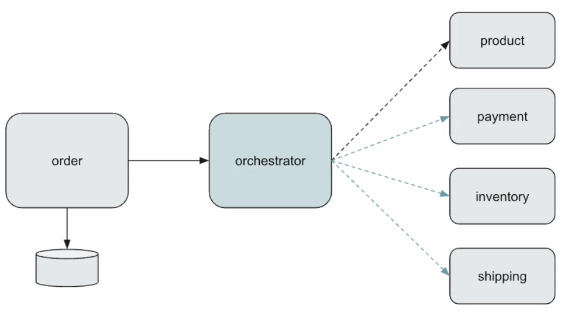

Así que, en vez de mantener esta lógica de coordinación en el servicio order, podemos separar esta lógica de coordinación e implementarlo como un servicio separado llamado `Orchestrator Service`.

En este caso, recibiremos una petición al servicio order. Este servicio realizará una validación básica y, una vez pasada, insertará un registro en BBDD con el status `order created`.

Pasará la petición al servicio orquestador, que realizará, siempre que sea posible, llamadas en paralelo el resto de servicios.

En nuestro caso, mandará una petición al servicio product para obtener información básica del producto, y luego hará llamadas en paralelo a los servicios payment, inventory y shipping.

Si todos son exitosos, responderemos con el status `successful` y el servicio order actualizará la BBDD.

Si uno de los servicios a los que llama nuestro orquestador falla por cualquier motivo, como que no tenemos inventario, tenemos que devolver el dinero al usuario y cancelar el envío y, por supuesto, la orden falla.

### Orchestrator Scope

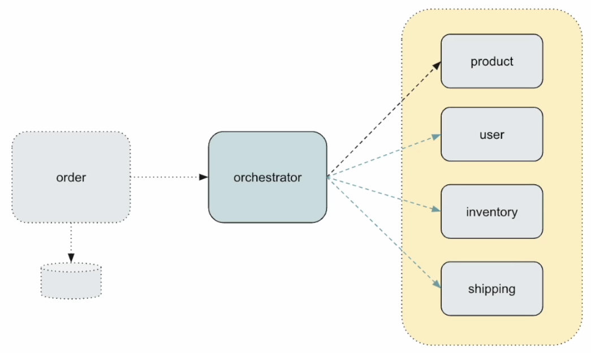

En esta sección vamos a implementar este orquestador.

No nos vamos a preocupar del servicio order, y nuestro servicio externo va a exponer todas las APIs para los servicios product, user, inventory y shipping.

Nuestro trabajo va a ser consumir estas APIs para implementar el orquestador.

Aunque parece fácil, veremos que hay que hacer mucho trabajo para implementarlo.

Entonces, cuando recibamos una petición en nuestro servicio orquestador, haremos primero una llamada al servicio product para obtener la información del producto. Luego haremos tres llamadas en paralelo al resto de servicios.

Si todo va bien, genial, pero si algo falla, tendremos que tomar una serie de acciones.

En la siguiente sección modificaremos este desarrollo para hacerlo secuencial.

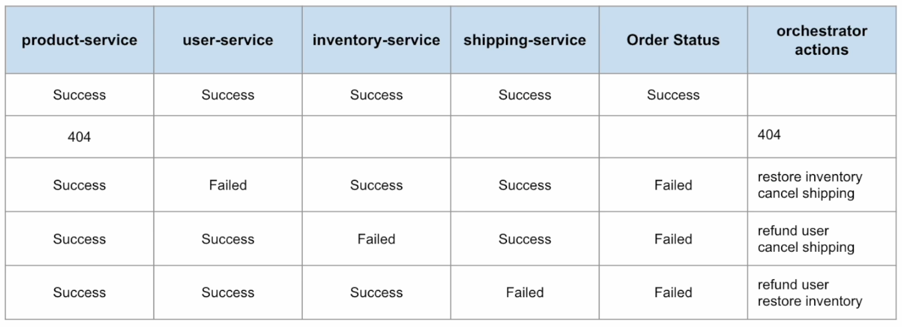

Tener en cuenta que en user-service miramos si el usuario dispone de saldo para poder hacer frente al pago del producto.

### External Services

Para nuestras clases del patrón Orquestador, tenemos que interaccionar con estos servicios externos (APIs):

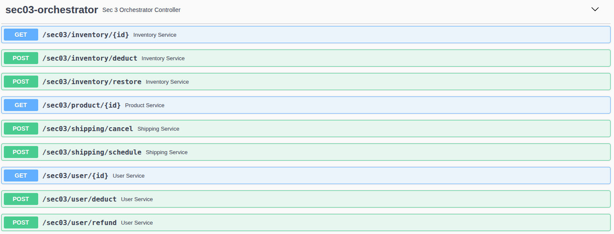

- Product Service: Tenemos 1 API.
  - /sec03/product/{id}
    - Nuestro punto de partida.
    - Podemos probar con el id 1 en todos las APIs.
- User Service: Tenemos 3 APIs.
  - /sec03/user/{id}
  - /sec03/user/deduct
    - La cantidad de saldo que queremos deducir del total del usuario.
  - /sec03/user/refund
    - Si tenemos que devolver el saldo al usuario.
- Inventory Service: Tenemos tres APIs.
  - /sec03/inventory/{id}
  - /sec03/inventory/deduct
    - La cantidad de producto que queremos deducir del total inventariado.
  - /sec03/inventory/restore
    - Si queremos devolver el inventario al almacén.
- Shipping Service: Tenemos 2 APIs.
  - /sec03/shipping/schedule
  - /sec03/shipping/cancel

En la siguiente imagen vemos un ejemplo de los logs que vamos a obtener al interaccionar con este servicio externo.

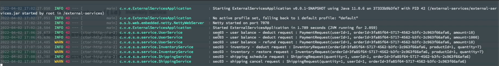

### Creating DTO

Creamos las clases DTO que necesitamos para obtener las respuestas de los servicios externos.

En `src/java/com/jmunoz/webfluxpatterns/sec03` creamos los paquetes/clases siguientes:

- `client`
- `controller`
- `dto`
  - `OrderRequest`: Es la petición que recibe del servicio order.
  - `OrderResponse`: Es la respuesta que devuelve nuestro orquestador al servicio order.
  - `Status`: Es un enum con los valores SUCCESS y FAILED.
  - `Address`: Es la dirección del usuario.
  - `Product`: Es la respuesta del servicio product. No hace falta una clase request porque solo tenemos que indicarle un id.
  - `PaymentRequest`: Es la petición al servicio user para realizar el pago.
  - `PaymentResponse`: Es la respuesta del servicio user.
  - `InventoryRequest`: Es la petición al servicio inventory para ver si hay disponibilidad del producto.
  - `InventoryResponse`: Es la respuesta del servicio inventory.
  - `ShippingRequest`: Es la petición al servicio shipping para realizar el envío del producto.
  - `ShippingResponse`: Es la respuesta del servicio shipping.
- `service`
- `util`

Los campos necesarios de los dtos los sabemos mirando Swagger.

### Creating Service Clients

En `src/java/com/jmunoz/webfluxpatterns/sec03` creamos las clases siguientes:

- `client`
  - `ProductClient`
  - `UserClient`
  - `InventoryClient`
  - `ShippingClient`

### Orchestrator Request Context

Nuestro orquestador tiene que coordinar todos los endpoints del servicio externo, ya que tenemos varios objetos request y response, y, como parte de ua petición a nuestro servicio orquestador, este tiene que crear un puñado de peticiones y tratar con otro puñado de respuestas.

Para mantenerlo simple, creamos un nuevo DTO, cuya misión es ser solamente una clase wrapper que contiene la referencia de las otras peticiones/respuestas.

Esta clase también nos facilita la vida en caso de debug.

En el curso de Webflux (https://github.com/JoseManuelMunozManzano/Spring-WebFlux-Masterclass-Reactive-Microservices), ya creamos un `request context object`.

En `src/java/com/jmunoz/webfluxpatterns/sec03` creamos las clases siguientes:

- `dto`
    - `OrchestrationRequestContext`: DTO wrapper de referencias de peticiones/respuestas.

### Util Class

Esta clase la necesitamos para crear todos los objetos request de OrchestrationRequestContext.

En `src/java/com/jmunoz/webfluxpatterns/sec03` creamos las clases siguientes:

- `util`
  - `OrchestrationUtil`: Crea los objetos request de OrchestrationRequestContext.

### Orchestrator Pattern Implementation - High Level Architecture


Vamos a empezar a trabajar en nuestra capa service, pero antes de empezar a escribir esas clases, vamos a informar primero de esto:

Tenemos un `orchestrator`. Primero va a llamar al servicio `product` y obtendremos su `ProductResponse`, y en concreto su precio.

Basados en la información que necesiten, haremos tres llamadas en paralelo al resto de servicios, `user`, `inventory` y `shipping`.

En la vida real, esto podrían ser muchos servicios, 10 o 20. En nuestro ejemplo tenemos estos 3.

Recordar que en la siguiente sección haremos este patrón orquestador usando llamadas secuenciales.

Mandaremos una petición para comenzar la transacción y recibiremos una respuesta, que validaremos. Cada una de las respuestas tiene que ser exitosa. En caso contrario, recordar la tabla de a lo que tenemos que hacer rollback.


Si todos los servicios fallan, no hay que hacer rollback de nada.

Todo esto lo recordamos porque vamos a crear una clase abstracta (también puede ser una interface) para modelar esto, con el objetivo de que, si en el futuro tenemos que añadir un nuevo servicio, esto nos facilite la vida.

Así es como vamos a implementarlo:

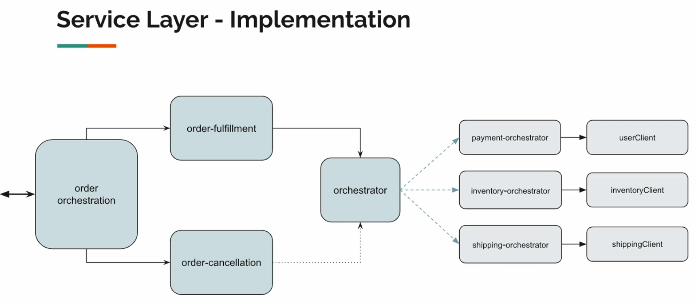

Ya tenemos creados `userClient`, `inventoryClient` y `shippingClient`.

Vamos a crear la clase abstracta (o una interface) `orchestrator` y sus implementaciones, `payment-orchestrator` (o podría ser `user-orchestrator` ya que usamos ambos nombres, pero como manejamos la parte de payment, por eso se elige ese nombre), `inventory-orchestrator` y `shipping-orchestrator`.

Vamos a tener algunas clases más, `order-fulfillment`, `order-cancellation` y la clase principal `order orchestration`.

`order orchestration` es la clase que recibe la petición del controller, y la pasa al servicio `order-fulfillment` que tiene todos los `orchestrator` en él, así que le preguntará a `orchestrator` mandar una petición en paralelo.

`order-fulfillment` recibirá la respuesta y se la devolverá a `order orchestration`. Si todas las respuestas pasan (exitosas) la devuelve inmediatamente al cliente.

Si algo falla, inmediatamente mandará la respuesta al cliente diciendo que ha fallado, y, por debajo, iniciará el proceso `order-cancellation`. Este proceso es completamente no bloqueante y asíncrono incluso desde la perspectiva del cliente (no se entera).

### Payment Handler

Vamos a trabajar en la clase abstracta y en una de las clases que la implementa.

En `src/java/com/jmunoz/webfluxpatterns/sec03` creamos las clases siguientes:

- `service`
    - `Orchestrator`: Clase abstracta.
    - `PaymentOrchestrator`: Implementación de Orchestrator.

### Inventory and Shipping Handlers

Vamos a trabajar en las otras clases que implementan la clase abstracta.

En `src/java/com/jmunoz/webfluxpatterns/sec03` creamos las clases siguientes:

- `service`
    - `InventoryOrchestrator`: Implementación de Orchestrator.
    - `ShippingOrchestrator`: Implementación de Orchestrator.

### Order Fulfillment Service

El servicio `order-fulfillment` es responsable de recibir la petición de `order orchestration` y llamar a las implementaciones de `orchestrator` para cumplir la petición, recoger la respuesta y devolvérsela a `order orchestration`.

En `src/java/com/jmunoz/webfluxpatterns/sec03` creamos las clases siguientes:

- `service`
    `OrderFulfillmentService`: Responsable de recibir la petición de `order orchestration` y llamar a las implementaciones de `orchestrator` para cumplir la petición, recoger la respuesta y devolvérsela a `order orchestration`.

### Order Cancellation Service

El servicio `order-cancellation` se invoca si queremos cancelar la orden. Es completamente no bloqueante y asíncrono.

En `src/java/com/jmunoz/webfluxpatterns/sec03` creamos las clases siguientes:

- `service`
    - `OrderCancellationService`: Se invoca si queremos cancelar la orden. Es completamente no bloqueante y asíncrono.

### Order Orchestrator Service

Es el servicio principal, el que recibe la petición desde el controller.

En `src/java/com/jmunoz/webfluxpatterns/sec03` creamos las clases siguientes:

- `service`
    - `OrchestratorService`: Es el servicio principal, el que recibe la petición desde el controller.

### Debug Util

Vamos a crear un método que imprima algo en consola, y así, si algo va mal, podremos mirarlo rápidamente.

En `src/java/com/jmunoz/webfluxpatterns/sec03` creamos las clases siguientes:

- `util`
    - `DebugUtil`: Utilidad para mostrar logs en consola.
- `service`
    - `OrchestratorService`: Añadimos la llamada para crear los logs.

### Controller

En `src/java/com/jmunoz/webfluxpatterns/sec03` creamos las clases siguientes:

- `controller`
    - `OrderController`

No olvidar, en nuestro main, es decir, en `WebfluxPatternsApplication`, cambiar a `@SpringBootApplication(scanBasePackages = "com.jmunoz.webfluxpatterns.sec03")`.

- `application.properties`

```
sec03.product.service=http://localhost:7070/sec03/product/
sec03.user.service=http://localhost:7070/sec03/user/
sec03.inventory.service=http://localhost:7070/sec03/inventory/
sec03.shipping.service=http://localhost:7070/sec03/shipping/
```

### Orchestrator Demo

- No olvidar ejecutar nuestro servicio externo.
- Ejecutar la app.
- Abrimos Postman.
  - En la carpeta `postman/sec03` se encuentra un fichero que podemos importar en Postman para las pruebas.

**Prueba OK**

Ejemplo de logs de ejecución de los servicios externos:

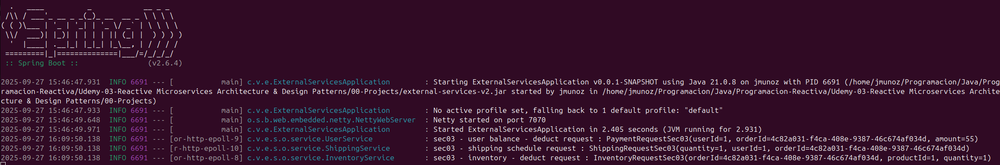

Ejemplo de logs de ejecución de nuestro Orchestrator:

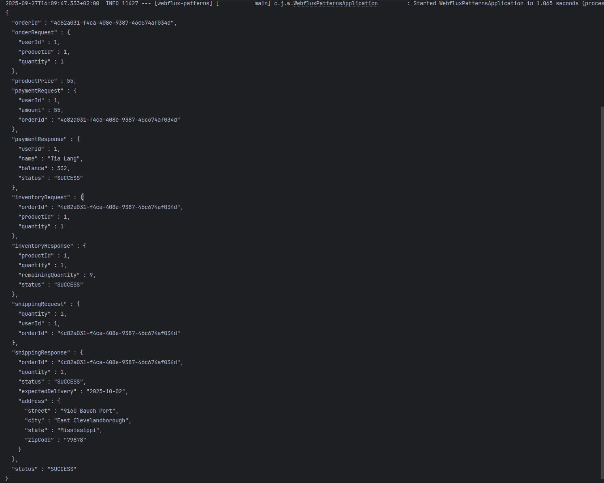

**Prueba KO**

Ejemplo de logs de ejecución de los servicios externos:

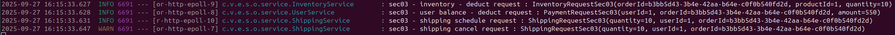

Ejemplo de logs de ejecución de nuestro Orchestrator:

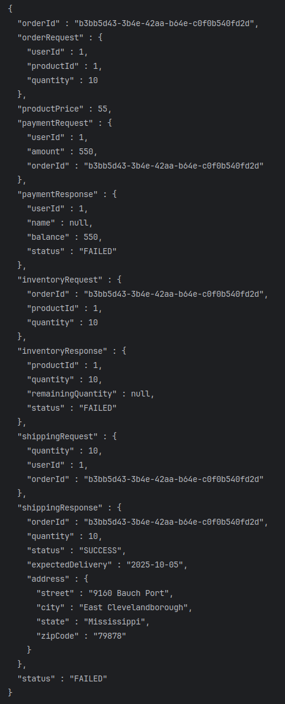

### Bug Fix

Tenemos un pequeño problema con nuestro código. Actualmente, en Postman podemos indicar un productId máximo de 50. Si indicamos el productId 51 da un error 500 (Internal Server Error).

El código de error correcto que debería indicar es 404.

En `src/java/com/jmunoz/webfluxpatterns/sec03` modificamos la clase siguiente para corregirlo:

- `service`
    - `OrchestratorService`: Corregimos método `getProduct`.

Una vez corregido, nuestro test en Postman devuelve 404 - Not Found.

### Quick Note

Como hacemos el refund, restore, etc. asíncronamente, **¿qué pasa si algo va mal durante ese proceso asíncrono?** El servicio podría no estar disponible.

Existen patrones de resiliencia como `Retry Pattern` que veremos más adelante, con lo que conseguimos más robustez.

Pero, en la vida real, también podríamos cambiar ligeramente el diseño para publicar un mensaje como parte de nuestro `order-cancellation`, en vez de hacer el refund, restore, etc.

Es decir, publicaríamos un mensaje en una cola de mensajes, luego procesaríamos el mensaje más tarde, como parte de un servicio diferente de refund, restore...

Otra pregunta sería **¿Por qué hacemos el deduct y luego, más tarde, restauramos el inventario?** ¿Es así como deberíamos implementar una aplicación e-commerce en la vida real?

Esto es un ejemplo para demostrar el patrón Orchestrator, así que podemos implementarlo más o menos así o podemos cambiar ligeramente el diseño, basado en nuestras necesidades.

Pero, el principal objetivo de este ejemplo, es demostrar el uso del patŕon Orchestrator.

## Orchestrator Pattern (For Sequential Workflow)

### Introduction

En esta sección hablaremos del mismo patrón Orchestrator que ya vimos en la sección anterior, pero con una ligera variación, ya que el flujo de trabajo va a ser secuencial.

Todos tenemos ciertos flujos de trabajo que tenemos que hacer en secuencia. Por ejemplo, tomemos un ciclo de vida de desarrollo de software.

- Analizamos los requerimientos.
- Codificamos.
- Desplegamos.
- Testeamos.
- Liberamos.

Este flujo no puede hacerse en paralelo, ya que los pasos dependen de que se completen los anteriores.

Para esto, tenemos un patrón de diseño llamado `Chained Pattern`, en el cual:

- No hay un agregador especial, a diferencia de los patrones que ya hemos visto.
- Cualquier servicio puede asumir el rol de agregador.

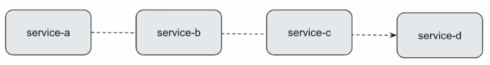

En este ejemplo, el servicio A recibe una petición, pero no puede procesarla él solo, necesita la ayuda del servicio B, así que lo llama.

El servicio B a su vez necesita la ayuda del servicio C para completarse, y el servicio C necesita el servicio D para completarse también.

Así que se van llamando. Esto es muy parecido al código Java, un método chaining o la composición.

Estos son los pros y los cons de `Chained Pattern`:

- Pros:
  - Fácil de implementar.
- Cons:
  - Se incrementa la latencia.
    - El tiempo que tarde cada uno de los servicios en completarse.
  - Muy difícil de hacer debug.
    - Vamos a necesitar ids de correlación porque si hay muchas excepciones, no vamos a saber de qué petición se obtuvo esa excepción.
  - Muy difícil de mantener/implementar cambios en los requerimientos.

Imaginemos este nuevo requerimiento:

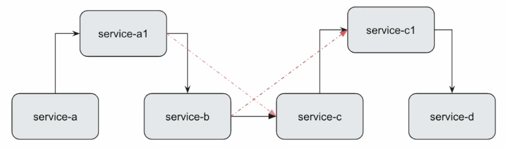

Tenemos que añadir dos nuevos servicios, service-a1 y service-c1.

Las flechas rojas indican que a veces service-a1 llamará a service-b y otras a service-c, y service-b a veces llamará a service-c y otras a service-c1.

Esto es muy difícil de introducir en código y de depurar en caso de problemas.

El patrón `Chained Pattern` es bueno para programas sencillos, pero se complica muchísimo si empiezan a crearse requerimientos.

Por tanto, **se desaconseja el uso de `Chained Pattern`**.

En cambio, se propone modificar ligeramente `Orchestrator Pattern` para proporcionar un flujo de trabajo secuencial.

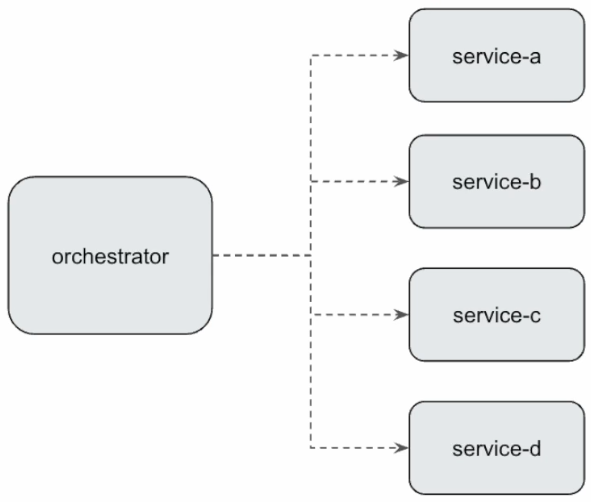

Tenemos `orchestrator`, que recibe una petición. En vez de que el servicio A llame al servicio B, y este al servicio C..., nuestro `orchestrator` llama a `service-a`. Recibe su respuesta y `orchestrator` llama a `service-b`. Recibe su respuesta y `orchestrator` llama a `service-c`, e igual con `service-d`.

- ¿Cómo se hace debug? Solo tenemos que mirar los logs de `orchestrator` y este nos dirá que servicio falló.
- ¿Qué pasa si tenemos que añadir dos nuevos servicios por un nuevo requerimiento?

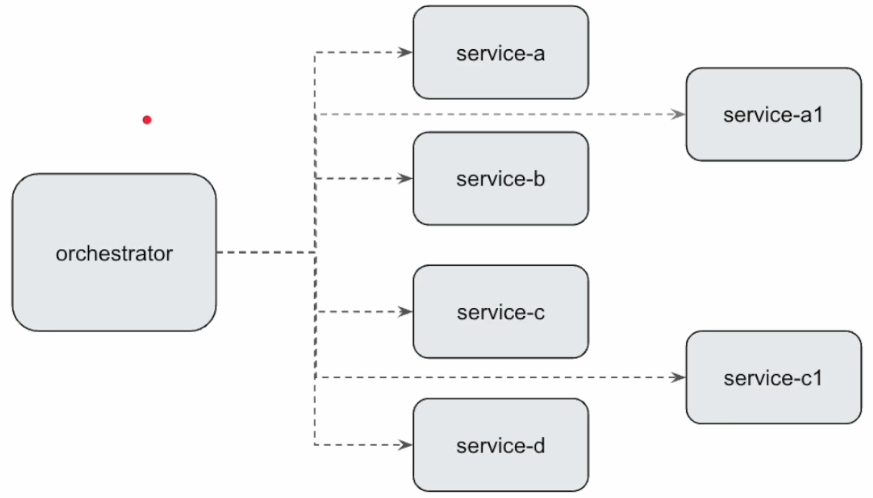

Solo tenemos que introducir los servicios `service-a1` y `service-c1` y actualizar la lógica de `orchestrator` para proveer el nuevo flujo.

No tenemos que cambiar los servicios porque ni siquiera saben el flujo de trabajo.

Estos son los pros y los cons de `Orchestrator Pattern` para flujos de trabajo encadenados:

- Pros:
  - Fácil de hacer debug.
  - Fácil de mantener / implementar cambios en requerimientos nuevos.
- Cons:
  - Incrementa la latencia, ya que los pasos a realizar son igualmente secuenciales.

**Proyecto**

Se va a realizar el mismo proyecto de la sección anterior pero con algunos ajustes:

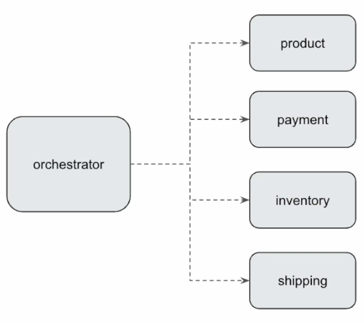

Nuestro `payment service` va a necesitar el precio del producto, por eso llamaremos primero a `product service` y luego a `payment service`.

Una vez detectado el pago, `payment service` proveerá algún tipo de id de confirmación que será requerido por `inventory service` para detectar el inventario, es decir, `inventory service` depende de la respuesta de `payment service`.

Una vez detectado el inventario, `inventory service` proveerá algún tipo de id de confirmación que será requerido por `shipping service` para enviar el producto.

Vemos que tenemos que hacer llamadas secuenciales para completar el flujo de trabajo.

Si se hace el pago, pero en `inventory service` detectamos que no queda inventario tenemos que devolver el dinero al usuario, pero no tenemos que hacer nada en el envío porque no ha llegado a hacerse.

Si se hace el pago y hay inventario, pero falla `shipping service`, tenemos que restaurar el inventario y devolver el dinero al usuario.

### External Services

Para nuestras clases del patrón Orquestador Secuencial, tenemos que interaccionar con estos servicios externos (mismas APIs que en la sección sec03, pero distinto orden de ejecución):

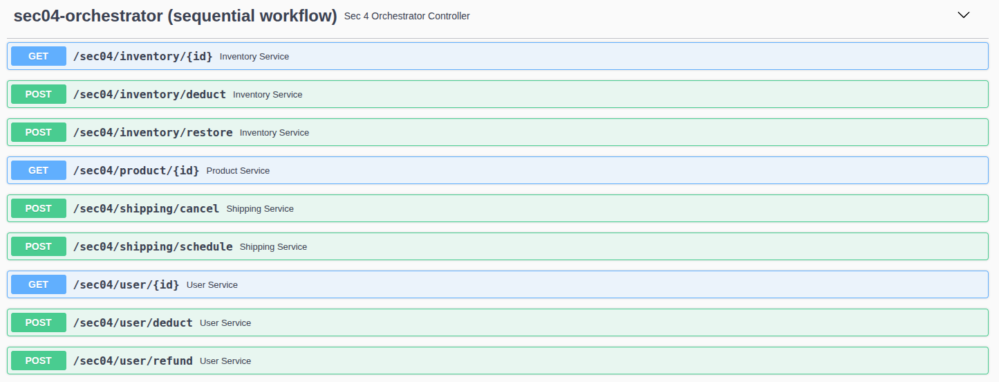

- User Service
    - /sec04/user/deduct
        - Nuestro punto de partida.
        - Genera un paymentId.
- Inventory Service
    - /sec04/inventory/deduct
        - La cantidad de producto que queremos deducir del total inventariado.
        - Usa el paymentId.
        - Genera un inventoryId.
- Shipping Service
    - /sec04/shipping/schedule
        - Usa inventoryId.
        - Genera un shippingId.

Los demás endpoints dependerán de alguno de estos ids generados, y su orden es el mismo que vimos en la sección anterior.

- Product Service
    - /sec04/product/{id}
- User Service
    - /sec04/user/{id}
    - /sec04/user/refund
- Inventory Service
    - /sec04/inventory/{id}
    - /sec04/inventory/restore
- Shipping Service
    - /sec04/shipping/cancel

### Project Setup

En `src/java/com/jmunoz/webfluxpatterns/sec04` creamos los paquetes/clases siguientes (copiados de sec03):

- `client`
    - `ProductClient`
    - `UserClient`
    - `InventoryClient`
    - `ShippingClient`
- `controller`
    - `OrderController`
- `dto`
    - `OrderRequest`: Es la petición que recibe del servicio order.
    - `OrderResponse`: Es la respuesta que devuelve nuestro orquestador al servicio order.
    - `Status`: Es un enum con los valores SUCCESS y FAILED.
    - `Address`: Es la dirección del usuario.
    - `Product`: Es la respuesta del servicio product. No hace falta una clase request porque solo tenemos que indicarle un id.
    - `PaymentRequest`: Es la petición al servicio user para realizar el pago.
    - `PaymentResponse`: Es la respuesta del servicio user.
    - `InventoryRequest`: Es la petición al servicio inventory para ver si hay disponibilidad del producto.
    - `InventoryResponse`: Es la respuesta del servicio inventory.
    - `ShippingRequest`: Es la petición al servicio shipping para realizar el envío del producto.
    - `ShippingResponse`: Es la respuesta del servicio shipping.
    - `OrchestrationRequestContext`: DTO wrapper de referencias de peticiones/respuestas.
- `service`
    - `Orchestrator`: Clase abstracta.
    - `PaymentOrchestrator`: Implementación de Orchestrator.
    - `InventoryOrchestrator`: Implementación de Orchestrator.
    - `ShippingOrchestrator`: Implementación de Orchestrator.
    - `OrderFulfillmentService`: Responsable de recibir la petición de `order orchestration` y llamar a las implementaciones de `orchestrator` para cumplir la petición, recoger la respuesta y devolvérsela a `order orchestration`.
    - `OrderCancellationService`: Se invoca si queremos cancelar la orden. Es completamente no bloqueante y asíncrono.
    - `OrchestratorService`: Es el servicio principal, el que recibe la petición desde el controller.
- `util`
    - `OrchestrationUtil`: Crea los objetos request de OrchestrationRequestContext.
    - `DebugUtil`: Utilidad para mostrar logs en consola.

### Creating DTO

En `src/java/com/jmunoz/webfluxpatterns/sec04` modificamos los paquetes/clases siguientes:

- `dto`
  - `PaymentResponse`: añadimos el campo `paymentId`.
  - `InventoryRequest`: modificamos `orderId` por `paymentId`.
  - `InventoryResponse`: añadimos el campo `inventoryId`.
  - `ShippingRequest`: modificamos `orderId` por `inventoryId`.
  - `ShippingResponse`: modificamos `orderId` por `shippingId`.

### Creating Service Clients

En `src/java/com/jmunoz/webfluxpatterns/sec04` modificamos los paquetes/clases siguientes para corregir los errores que aparecen al cambiar los DTOs:

- `client`
  - `InventoryClient`
  - `ShippingClient`
  - `UserClient`

### Util Class

En `src/java/com/jmunoz/webfluxpatterns/sec04` modificamos los paquetes/clases siguientes:

- `util`
  - `OrchestrationUtil`

### Sequential Workflow - Architecture

Antes de modificar la capa de servicio, vamos a explicar como se piensa cambiar.

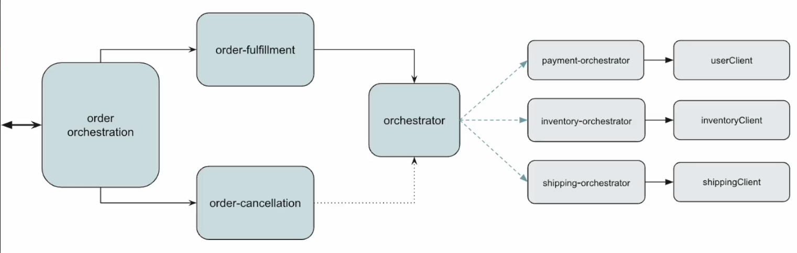

En la imagen puede verse la implementación de la capa de servicio que se hizo en la sección anterior. Teníamos:

- `orchestrator`: Clase abstracta.
- `payment-orchestrator`, `inventory-orchestrator`, `shipping-orchestrator`: Implementaciones de `orchestrator` para cada cliente.

Se hacían llamadas en paralelo y, como parte de esas peticiones en paralelo, obteníamos respuestas, éxito o error, una respuesta por cada cliente.

Basado en el status de las respuestas, diseñábamos la respuesta de `order-fulfillment` hacia `order orchestration`. Si era éxito, devolvía la respuesta al cliente y, si era error, devolvía la respuesta al cliente y se pasaba en segundo plano (asíncrono) una petición a `order-cancellation` para devolver el dinero, restaurar el inventario...

Esta arquitectura va a ser más o menos la misma, con la diferencia de que `order-fulfillment`, en vez de hacer llamadas en paralelo, va a realizar llamadas secuenciales usando `orchestrator`.

Primero, se llamará a `payment-orchestrator`. Una vez recibida la respuesta, si es exitosa seguimos con el siguiente paso, `inventory-orchestrator` y si es exitoso seguimos con `shipping-orchestrator`.

Si alguna de las llamadas falla, por ejemplo `payment-orchestrator`, no tiene sentido seguir con las siguientes llamadas, y terminamos inmediatamente. Es decir, si alguna salida es erronea, `orchestrator` emitirá una señal de error, indicando que no va a seguir ejecutando los siguientes procesos.

`order-fulfillment`, si ve un error, fallará también inmediatamente y parará el pipeline pasando el error a `order orchestration`.

`order orchestration` mirará el resultado. Tanto si es exitoso como erroneo, lo pasa al cliente. En caso de error, llamará por detrás (asíncrono) a `order-cancellation` para devolver el dinero al usuario, restaurar el inventario, etc. Esto se puede hacer en paralelo.

### Sequential Workflow - Implementation

En `src/java/com/jmunoz/webfluxpatterns/sec04` modificamos los paquetes/clases siguientes:

- `exception`
    - `OrderFulfillmentFailure`: Como se ha decidido emitir una señal de error cuando algo no vaya según lo esperado, creamos esta excepción personalizada.
- `service`
    - `Orchestrator`: Clase abstracta.
    - `PaymentOrchestrator`: Implementación de Orchestrator. 
    - `ShippingOrchestrator`: Implementación de Orchestrator.
    - `InventoryOrchestrator`: Implementación de Orchestrator.
    - `OrderFulfillmentService`: Realiza las llamadas secuenciales.
    - `OrchestratorService`: Es el servicio principal, el que recibe la petición desde el controller.
    - `OrderCancellationService`: Se invoca si queremos cancelar la orden. Es completamente no bloqueante y asíncrono.

### Sequential Workflow - Demo

No olvidar, en nuestro main, es decir, en `WebfluxPatternsApplication`, cambiar a `@SpringBootApplication(scanBasePackages = "com.jmunoz.webfluxpatterns.sec04")`.

- `application.properties`

```
sec04.product.service=http://localhost:7070/sec04/product/
sec04.user.service=http://localhost:7070/sec04/user/
sec04.inventory.service=http://localhost:7070/sec04/inventory/
sec04.shipping.service=http://localhost:7070/sec04/shipping/
```

- No olvidar ejecutar nuestro servicio externo.
- Ejecutar la app.
- Abrimos Postman.
    - En la carpeta `postman/sec04` se encuentra un fichero que podemos importar en Postman para las pruebas.
