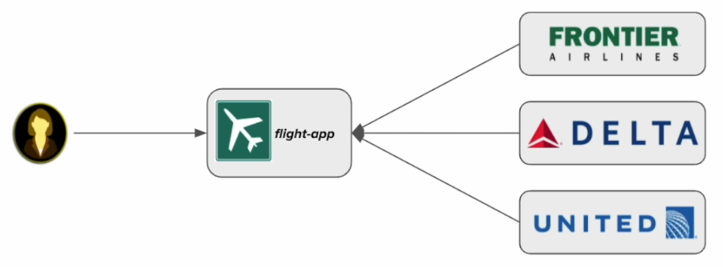
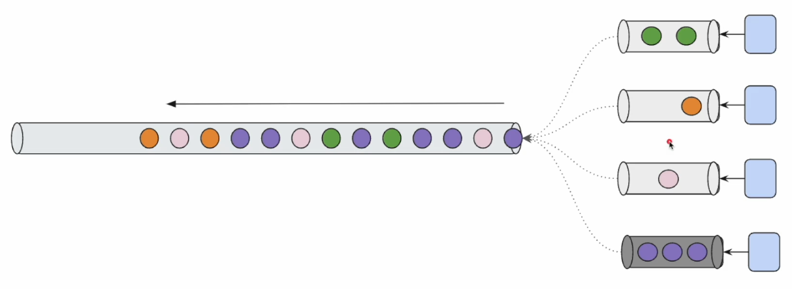

# REACTIVE MICROSERVICES ARCHITECTURE & DESIGN PATTERNS

## Project webfluxpatterns

Para crear el proyecto accederemos a `https://start.spring.io/` e indicaremos estos datos:


## Gateway Aggregator Pattern

**¿Qué problema trata de resolver?**

Consideremos una aplicación en la que tenemos un montón de servicios como esta:


La aplicación cliente (o el navegador) tiene que obtener información de todos esos servicios backend para hacer su trabajo o construir una página.

Los problemas de este enfoque son los siguientes:

- El navegador o aplicación cliente tiene que hacer muchas llamadas por red.
- Los navegadores tienen un límite de llamadas a la vez (paralelas) a un dominio, por ejemplo, Chrome tiene un límite de 6. ¿Qué pasa si tiene que hacer 8 llamadas a servicios? Chrome hará primero 6 llamadas y una vez que cualquiera de las llamadas se complete, usará ese espacio para hacer las llamadas pendientes.
- Incremento de latencia. Imaginemos que los servidores están en USA y el cliente en Europa. Cada petición tendrá su latencia.
- Lógica de agregación compleja en el frontend. ¿Qué pasa si tenemos que añadir una característica extra introduciendo un servicio más? Tenemos que manejar esa lógica en el cliente además de la ya existente, es decir, se añade una complejidad extra.

Aquí es donde entra el patrón Agregador:


El agregador es un microservicio separado cuyo trabajo es recibir las peticiones del cliente y llamar a los servicios ascendentes, recopilar la información y devolverla al cliente. Así, escode toda la complejidad del backend.

En otras palabras, actúa como un patrón Proxy o Facade.

Desde el punto de vista del cliente, solo existe una llamada, así **el cliente solo tiene que preocuparse de la lógica de presentación**.

Si tenemos que añadir una nueva característica, o tenemos que introducir uno o más microservicios, podemos asumir con seguridad que cada agregador tomará las responsabilidad de obtener la información e incluirla en la respuesta.

Consideremos esta página de detalle de producto de Amazon:


Aquí podemos ver muchísima información sobre el producto, como el título, ratings, preguntas y respuestas, precio, ofertas promocionales, etc. Estoy seguro que no se obtiene toda esta información de un único servicio. Existirá un `productService` que contiene información del producto como el título, habrá un `pricingService`, `reviewService`, `promotionService`, etc.

Pero la página que se muestra actúa como un dashboard, combinando toda esta información proveniente de varias fuentes en una respuesta.

**Product Details Page**

Vamos a hacer un agregador parecido a la página de Amazon (parte backend).


Asumamos que somos parte de una organización en la que hay muchos equipos. Un equipo desarrolla la información de producto, otro las reviews, otro los detalles de las promociones, etc.

La parte del agregador la hace nuestro equipo, así que es lo que vamos a desarrollar en esta sección.

### External Services

Para nuestras clases del patrón Agregador, tenemos que interaccionar con estos tres servicios externos:


- Product Service
    - Provee detalles de productos para un productId (desde id 1 hasta id 50).
- Promotion Service
    - Los productId 5, 10, 15, 20, 25, 30, 35, 40, 45, 50 no se encuentran en este servicio.
- Review Service
    - Los productId 10, 20, 30, 40, 50 no se encuentran en este servicio. El productId 7 tiene errores extraños.

La data obtenida es aleatoria y varía de una ejecución a otra para un mismo id.

En la vida real, cada uno de estos endpoints sería un servicio jar distinto, y tendríamos que escuchar en diferentes puertos. Pero para mantenerlo simple para este curso, se han combinado todos los servicios en un único jar, aunque a nivel de estudio, los vamos a tratar como servicios distintos.

Nuestro trabajo es desarrollar el servicio `aggregator`:


El cliente nos envía una petición, por ejemplo, dame la información del producto 1. Nuestra misión es llamar a todos esos servicios externos y devolveremos la respuesta que se ve en la imagen al cliente, con ese formato. Con esto, el cliente solo se tiene que preocupar de la lógica de presentación.

### Project Setup

En `src/java/com/jmunoz/webfluxpatterns/sec01` creamos los paquetes siguientes:

- `client`
- `controller`
- `dto`
- `service`

### Creating DTO

Creamos las clases DTO que necesitamos para obtener las respuestas de los servicios externos, una clase de precios y otra con la información agrupada que devolveremos a nuestro cliente.

En `src/java/com/jmunoz/webfluxpatterns/sec01` creamos las siguientes clases:

- `dto`
  - `ProductResponse`: La respuesta que esperamos del servicio externo `Product Service`.
  - `PromotionResponse`: La respuesta que esperamos del servicio externo `Promotion Service`.
  - `Review`: La respuesta que esperamos del servicio externo `Review Service`.
  - `ProductAggregate`: Es la información agrupada que devolveremos a nuestro cliente.
  - `Price`: Información de precios con cálculos que ya tiene en cuenta promociones.
    - Evitamos que estos cálculos los haga el cliente.
    - El cliente solo se preocupa de la parte de presentación.

### Creating External Service Client

En `src/java/com/jmunoz/webfluxpatterns/sec01` creamos las siguientes clases:

- `client`
  - `ProductClient`: Llamamos a nuestro upstream service.
  - `PromotionClient`: Llamamos a nuestro upstream service.
  - `ReviewClient`: Llamamos a nuestro upstream service.

### Aggregator Service

Vamos a trabajar en la capa de servicio, para responder a lo que quiere nuestro cliente.

Nuestro servicio Aggregator sabrá a qué servicios tiene que llamar y que responden, gracias a nuestros DTOs y los service clients que ya hemos construido.

Para llamar a más de un publisher y que nos devuelvan sus resultados, usaremos el operador `zip()`.

Usamos ese operador porque las llamadas no son secuenciales. 

**NO VAMOS A HACER ESTO:** Llamamos a un servicio, por ejemplo, el de review, y esperaremos sus resultados. Luego llamamos al servicio de producto y esperamos sus resultados y por último llamamos al servicio de promociones y esperamos sus resultados. Esto afecta al rendimiento.

Con `zip()` haremos todas las llamadas en paralelo y obtendremos las respuestas de manera no bloqueante, daremos esas respuestas a nuestro aggregator service, las ensamblaremos y las devolveremos al cliente.

En `src/java/com/jmunoz/webfluxpatterns/sec01` creamos las siguientes clases:

- `service`
  - `ProductAggregatorService`

### Aggregator Controller

En `src/java/com/jmunoz/webfluxpatterns/sec01` creamos las siguientes clases:

- `controller`
  - `ProductAggregateController`

- `application.properties`: Indicamos ciertas propiedades bajo el comentario `# Aggregator Pattern (sec01)`

### Gateway Aggregator Pattern Demo

- Ejecutamos nuestro servicio externo: `java -jar external-services-v2.jar`.
- `WebfluxPatternsApplication`: Indicamos `@SpringBootApplication(scanBasePackages = "com.jmunoz.webfluxpatterns.sec01")` y ejecutamos.
- Accedemos al navegador, a la url siguiente: http://localhost:8080/sec01/product/2

El resultado esperado es este:


### Is our Aggregator resilient?

Vimos en la clase anterior que todo funcionó bien, pero ¿seguro que nuestro servicio funciona bien?

Si ejecutamos en el navegador esta prueba: http://localhost:8080/sec01/product/85 veremos el siguiente error:


Y en los logs vemos:

```
org.springframework.web.reactive.function.client.WebClientResponseException$NotFound: 404 Not Found from GET http://localhost:7070/sec01/product/85
	at org.springframework.web.reactive.function.client.WebClientResponseException.create(WebClientResponseException.java:324) ~[spring-webflux-6.2.10.jar:6.2.10]
	Suppressed: reactor.core.publisher.FluxOnAssembly$OnAssemblyException: 
Error has been observed at the following site(s):
	*__checkpoint ⇢ 404 NOT_FOUND from GET http://localhost:7070/sec01/product/85 [DefaultWebClient]
	*__checkpoint ⇢ Handler com.jmunoz.webfluxpatterns.sec01.controller.ProductAggregateController#getProductAggregate(Integer) [DispatcherHandler]
	*__checkpoint ⇢ HTTP GET "/sec01/product/85" [ExceptionHandlingWebHandler]
```

Nos indica un error 404 al obtener el producto 85.

Para la url http://localhost:8080/sec01/product/7 también obtenemos un error

```
org.springframework.web.reactive.function.client.WebClientResponseException$InternalServerError: 500 Internal Server Error from GET http://localhost:7070/sec01/review/7
	at org.springframework.web.reactive.function.client.WebClientResponseException.create(WebClientResponseException.java:332) ~[spring-webflux-6.2.10.jar:6.2.10]
	Suppressed: reactor.core.publisher.FluxOnAssembly$OnAssemblyException: 
Error has been observed at the following site(s):
	*__checkpoint ⇢ 500 INTERNAL_SERVER_ERROR from GET http://localhost:7070/sec01/review/7 [DefaultWebClient]
	*__checkpoint ⇢ Handler com.jmunoz.webfluxpatterns.sec01.controller.ProductAggregateController#getProductAggregate(Integer) [DispatcherHandler]
	*__checkpoint ⇢ HTTP GET "/sec01/product/7" [ExceptionHandlingWebHandler]
```

En este caso un error 500 al obtener la review 7.

Vemos que si algún servicio falla, falla todo. Vamos a corregir esto.

### Making Aggregator more resilient!

Hemos encontrado algunos problemas en nuestro servicio Aggregator. Primero tenemos que entender las razones tras estos problemas.

El operador `zip()` recolecta todos los items de los servicios publishers externos y los da como una tupla. Para que el operador `zip()` funcione, todos los publishers tienen que emitir su data.

Si un publisher falla, `zip()` emitirá la señal de error al subscriber (nuestro servicio Aggregator).

Es decir `zip()` es todo o nada.


El servicio Product es el principal. Es bueno tener las promociones y las reviews, pero si fallan con error 500 no debería dar error, y deberíamos poder construir la respuesta.

Si algo falla en el servicio de reviews o de promociones, vamos a suponer que no habían.

De esta forma, podemos hacer nuestro servicio más resiliente.

En `src/java/com/jmunoz/webfluxpatterns/sec01` corregimos las siguientes clases:

- `client`
    - `PromotionClient`: Lo hacemos más resiliente. Si ocurre algún error, suponemos que no hay promociones.
    - `ReviewClient`: Lo hacemos más resiliente. Si ocurre algún error, suponemos que no hay reviews.

Hacemos ahora las mismas pruebas:

- http://localhost:8080/sec01/product/5
  - No hay descuentos, pero funciona.
- http://localhost:8080/sec01/product/7
  - Hay un error extraño en las reviews, pero funciona porque devuelve una lista vacía de reviews.
- http://localhost:8080/sec01/product/85
  - Sigue sin funcionar porque el id no existe. Lo vemos más adelante.

Si en `application.properties` simulamos que el servicio de reviews está caído, asignando otro puerto a `sec01.review.service` y volvemos a ejecutar nuestra app, veremos que seguimos funcionando y que se devuelve una lista de reviews vacía.

Esto es resiliencia.

### Are we making parallel calls?

Vamos a hacer tests rápidos a nuestro servicio Aggregator.

¿Está haciendo realmente todas esas llamadas en paralelo? Para probar esto, al ejecutar nuestro servicio externo, vamos a incluir una propiedad para retrasar la respuesta y simular que nuestro servicio externo es lento.

- Ejecutamos nuestro servicio externo con un delay de 3sg por endpoint: `java -jar external-services-v2.jar --sec01.delay.response=3000`.
- `WebfluxPatternsApplication`: Indicamos `@SpringBootApplication(scanBasePackages = "com.jmunoz.webfluxpatterns.sec01")` y ejecutamos.
- Accedemos al navegador, a la url siguiente: http://localhost:8080/sec01/product/2

Si fuera secuencial, las tres llamadas nos tomarían 9sg, pero NO LO ES, ES PARALELO Y TARDA 3sg.

### Product Service error handling

Hemos visto que si ejecutamos esta url en el navegador: http://localhost:8080/sec01/product/85, seguimos teniendo un error 500, porque ese producto no existe.

Product Service es el servicio principal, tiene que funcionar. Si este servicio ha caído o no es accesible, no vamos a poder construir la respuesta a nuestro cliente.

Sin embargo, si ocurre un error en Product Service, tenemos que manejarlo para que no falle nuestro servicio Aggregator.

En `src/java/com/jmunoz/webfluxpatterns/sec01` corregimos las siguientes clases:

- `client`
    - `ProductClient`: Si se emite la señal de error, devolvemos empty.

**Funcionamiento**

- `ProductClient` emite la señal de error y devuelve empty.
- `ProductAggregatorService`: Como zip() recibe una señal empty devuelve la señal empty.
- `ProductAggregateController`: Como hemos recibido empty, no hay producto, así que devolvemos error 404 (notFound()).

Así se gestiona correctamente la excepción, devolviendo 404 en vez de 500.

Con esta respuesta, el cliente puede hacer una redirección a la página 404, o lo que sea.

## Scatter Gather Pattern

**¿Qué problema trata de resolver?**


En este patrón tendremos un servicio y recibiremos una petición del cliente. Ese servicio llamará a todos los servicios siguientes y recolectará (gather) los resultados y responderá al cliente.

A primera vista parece igual que `Gateway Aggregator Pattern`, y es parecido, pero con un caso de uso específico:

- ~aggregator
- Transmite el mensaje a todos los destinatarios (no tiene por qué ser exactamente el mismo) y luego recoge la respuesta.
- Casos de uso:
  - Buscar datos desde múltiples fuentes.
  - Dividir el trabajo y hacer procesamiento paralelo.



Consideremos una aplicación de reserva de vuelos, algo como Google Flights, Kayak o algo así. El usuario introduce un origen y un destino y pulsa el botón para buscar vuelos.

La aplicación recibe la petición y actuará como un agente de viajes. Transmite a todos los servicios, Frontier, Delta y United, preguntando si tienen vuelos para este origen y destino, y que le envíen los detalles. Recoge todos los resultados y los devuelve a un cliente, para que seleccione el más barato, o el que sea.

El nombre Scatter indica que dispersa la petición a todos los demás servicios y recoge las respuestas.

Para entender por completo la diferencia entre `Gateway Aggregator Pattern` y `Scatter Gather Pattern` ver esta imagen:


La parte izquierda corresponde al `Gateway Aggregator Pattern`. Lo que hacemos es pedir a los servicios las diferentes partes de las que consta el coche para poder ensamblarlo.

La parte derecha corresponde al `Scatter Gather Pattern`. Lo que hacemos es preguntar a los distintos servicios si tiene el coche, para que se lo envíen. Entonces elegirá el mejor, el más barato, o los recogerá todos.

### External Services

Para nuestras clases del patrón Scatter, tenemos que interaccionar con estos tres servicios externos:


- Delta Service
    - No hay validaciones de from / to. Hay errores ocasionales (para realizar el manejo de excepciones)
    - El tipo de respuesta es text/event-stream
    - Probar indicando from = ATL y to = LAS
    - Probar en un navegador usando la URL siguiente: http://localhost:7070/sec02/delta/ATL/LAS para ver el resultado en formato streaming.
- Frontier Service
    - Solo acepta peticiones POST. No hay validaciones de from / to. Hay errores ocasionales (para realizar el manejo de excepciones)
    - El tipo de respuesta es text/event-stream
    - Probar indicando `{ "from": "ATL", "to": "LAS" }` 
- Jetblue Service
    - No hay validaciones de from / to. Hay errores ocasionales (para realizar el manejo de excepciones)
    - El tipo de respuesta es text/event-stream 
    - Probar indicando from = ATL y to = LAS

Tenemos tres servicios diferentes de aerolíneas. Una es Delta, la otra Frontier y la última es Jetblue. Cada uno de esos servicios devuelve distinta data.

Nuestra misión es ocultar estas complejidades usando un patrón Scatter Gather.

### Creating DTO

Creamos las clases DTO que necesitamos para obtener las respuestas de los servicios externos.

En `src/java/com/jmunoz/webfluxpatterns/sec02` creamos los paquetes/clases siguientes:

- `client`
- `controller`
- `dto`
  - `FlightResult`
- `service`

### Creating Delta Service Client

En `src/java/com/jmunoz/webfluxpatterns/sec02` creamos las clases siguientes:

- `client`
  - `DeltaClient`

### Creating JetBlue / Frontier Service Client

En `src/java/com/jmunoz/webfluxpatterns/sec02` creamos las clases siguientes:

- `client`
  - `JetBlueClient`
  - `FrontierClient`

### Creating Service

En `src/java/com/jmunoz/webfluxpatterns/sec02` creamos las clases siguientes:

- `service`
  - `FlightSearchService`

### Creating Controller

En `src/java/com/jmunoz/webfluxpatterns/sec02` creamos las clases siguientes:

- `controller`
  - `FlightsController`

No olvidar, en nuestro main, es decir, en `WebfluxPatternsApplication`, cambiar a `@SpringBootApplication(scanBasePackages = "com.jmunoz.webfluxpatterns.sec02")`.

- `application.properties`

```
sec02.delta.service=http://localhost:7070/sec02/delta/
sec02.frontier.service=http://localhost:7070/sec02/frontier/
sec02.jetblue.service=http://localhost:7070/sec02/jetblue/
```

### Scatter Gather Demo

- No olvidar ejecutar nuestro servicio externo.
- Ejecutar la app.
- Abrimos un navegador y vamos a la ruta: http://localhost:8080/sec02/flights/ATL/LAS

## Orchestrator Pattern (For Parallel Workflow)

### Introduction

- Aggregator + lógica de negocio adicional para proveer un flujo de trabajo o controlar el flujo de ejecución.


Consideremos una aplicación de ingresos en la que tenemos servicios de producto, pago, inventario y envío. Todos esos servicios tienen su propio CRUD API e individualmente todos funcionan bien.

Para realizar una orden de manera exitosa, recibimos una petición a nuestro servicio Order y este enviará una petición a cada servicio y todos deben terminar correctamente.

Es decir, si recibimos una petición de un producto, este tiene que existir, el usuario debe tener suficiente saldo, el producto debe estar disponible en el inventario y el servicio de envío debe estar listo para poder enviar el producto.

Si todo se cumple, la orden es exitosa. En caso contrario, la orden falla.

Si la orden falla, no podemos sencillamente indicar al usuario que la orden ha fallado. Imaginemos que falla el servicio de inventario porque no hay disponibilidad de ese producto. Tenemos que devolver el dinero al usuario, porque ya lo hemos cobrado.

Esto significa que hay mucho ir y venir de comunicaciones entre los servicios.

En la vida real, el servicio order tendrá sus propias operaciones CRUD y sus correspondientes APIs, como `getOrder()`, `postOrder()`, etc. Así que acomodar esta coordinación adicional entre los servicios es demasiado trabajo.


Así que, en vez de mantener esta lógica de coordinación en el servicio order, podemos separar esta lógica de coordinación e implementarlo como un servicio separado llamado `Orchestrator Service`.

En este caso, recibiremos una petición al servicio order. Este servicio realizará una validación básica y, una vez pasada, insertará un registro en BBDD con el status `order created`.

Pasará la petición al servicio orquestador, que realizará, siempre que sea posible, llamadas en paralelo el resto de servicios.

En nuestro caso, mandará una petición al servicio product para obtener información básica del producto, y luego hará llamadas en paralelo a los servicios payment, inventory y shipping.

Si todos son exitosos, responderemos con el status `successful` y el servicio order actualizará la BBDD.

Si uno de los servicios a los que llama nuestro orquestador falla por cualquier motivo, como que no tenemos inventario, tenemos que devolver el dinero al usuario y cancelar el envío y, por supuesto, la orden falla.

### Orchestrator Scope


En esta sección vamos a implementar este orquestador.

No nos vamos a preocupar del servicio order, y nuestro servicio externo va a exponer todas las APIs para los servicios product, user, inventory y shipping.

Nuestro trabajo va a ser consumir estas APIs para implementar el orquestador.

Aunque parece fácil, veremos que hay que hacer mucho trabajo para implementarlo.

Entonces, cuando recibamos una petición en nuestro servicio orquestador, haremos primero una llamada al servicio product para obtener la información del producto. Luego haremos tres llamadas en paralelo al resto de servicios.

Si todo va bien, genial, pero si algo falla, tendremos que tomar una serie de acciones.

En la siguiente sección modificaremos este desarrollo para hacerlo secuencial.


Tener en cuenta que en user-service miramos si el usuario dispone de saldo para poder hacer frente al pago del producto.

### External Services

Para nuestras clases del patrón Orquestador, tenemos que interaccionar con estos servicios externos (APIs):


- Product Service: Tenemos 1 API.
  - /sec03/product/{id}
    - Nuestro punto de partida.
    - Podemos probar con el id 1 en todos las APIs.
- User Service: Tenemos 3 APIs.
  - /sec03/user/{id}
  - /sec03/user/deduct
    - La cantidad de saldo que queremos deducir del total del usuario.
  - /sec03/user/refund
    - Si tenemos que devolver el saldo al usuario.
- Inventory Service: Tenemos tres APIs.
  - /sec03/inventory/{id}
  - /sec03/inventory/deduct
    - La cantidad de producto que queremos deducir del total inventariado.
  - /sec03/inventory/restore
    - Si queremos devolver el inventario al almacén.
- Shipping Service: Tenemos 2 APIs.
  - /sec03/shipping/schedule
  - /sec03/shipping/cancel

En la siguiente imagen vemos un ejemplo de los logs que vamos a obtener al interaccionar con este servicio externo.


### Creating DTO

Creamos las clases DTO que necesitamos para obtener las respuestas de los servicios externos.

En `src/java/com/jmunoz/webfluxpatterns/sec03` creamos los paquetes/clases siguientes:

- `client`
- `controller`
- `dto`
  - `OrderRequest`: Es la petición que recibe del servicio order.
  - `OrderResponse`: Es la respuesta que devuelve nuestro orquestador al servicio order.
  - `Status`: Es un enum con los valores SUCCESS y FAILED.
  - `Address`: Es la dirección del usuario.
  - `Product`: Es la respuesta del servicio product. No hace falta una clase request porque solo tenemos que indicarle un id.
  - `PaymentRequest`: Es la petición al servicio user para realizar el pago.
  - `PaymentResponse`: Es la respuesta del servicio user.
  - `InventoryRequest`: Es la petición al servicio inventory para ver si hay disponibilidad del producto.
  - `InventoryResponse`: Es la respuesta del servicio inventory.
  - `ShippingRequest`: Es la petición al servicio shipping para realizar el envío del producto.
  - `ShippingResponse`: Es la respuesta del servicio shipping.
- `service`
- `util`

Los campos necesarios de los dtos los sabemos mirando Swagger.

### Creating Service Clients

En `src/java/com/jmunoz/webfluxpatterns/sec03` creamos las clases siguientes:

- `client`
  - `ProductClient`
  - `UserClient`
  - `InventoryClient`
  - `ShippingClient`

### Orchestrator Request Context

Nuestro orquestador tiene que coordinar todos los endpoints del servicio externo, ya que tenemos varios objetos request y response, y, como parte de ua petición a nuestro servicio orquestador, este tiene que crear un puñado de peticiones y tratar con otro puñado de respuestas.

Para mantenerlo simple, creamos un nuevo DTO, cuya misión es ser solamente una clase wrapper que contiene la referencia de las otras peticiones/respuestas.

Esta clase también nos facilita la vida en caso de debug.

En el curso de Webflux (https://github.com/JoseManuelMunozManzano/Spring-WebFlux-Masterclass-Reactive-Microservices), ya creamos un `request context object`.

En `src/java/com/jmunoz/webfluxpatterns/sec03` creamos las clases siguientes:

- `dto`
    - `OrchestrationRequestContext`: DTO wrapper de referencias de peticiones/respuestas.

### Util Class

Esta clase la necesitamos para crear todos los objetos request de OrchestrationRequestContext.

En `src/java/com/jmunoz/webfluxpatterns/sec03` creamos las clases siguientes:

- `util`
  - `OrchestrationUtil`: Crea los objetos request de OrchestrationRequestContext.

### Orchestrator Pattern Implementation - High Level Architecture


Vamos a empezar a trabajar en nuestra capa service, pero antes de empezar a escribir esas clases, vamos a informar primero de esto:

Tenemos un `orchestrator`. Primero va a llamar al servicio `product` y obtendremos su `ProductResponse`, y en concreto su precio.

Basados en la información que necesiten, haremos tres llamadas en paralelo al resto de servicios, `user`, `inventory` y `shipping`.

En la vida real, esto podrían ser muchos servicios, 10 o 20. En nuestro ejemplo tenemos estos 3.

Recordar que en la siguiente sección haremos este patrón orquestador usando llamadas secuenciales.

Mandaremos una petición para comenzar la transacción y recibiremos una respuesta, que validaremos. Cada una de las respuestas tiene que ser exitosa. En caso contrario, recordar la tabla de a lo que tenemos que hacer rollback.


Si todos los servicios fallan, no hay que hacer rollback de nada.

Todo esto lo recordamos porque vamos a crear una clase abstracta (también puede ser una interface) para modelar esto, con el objetivo de que, si en el futuro tenemos que añadir un nuevo servicio, esto nos facilite la vida.

Así es como vamos a implementarlo:


Ya tenemos creados `userClient`, `inventoryClient` y `shippingClient`.

Vamos a crear la clase abstracta (o una interface) `orchestrator` y sus implementaciones, `payment-orchestrator` (o podría ser `user-orchestrator` ya que usamos ambos nombres, pero como manejamos la parte de payment, por eso se elige ese nombre), `inventory-orchestrator` y `shipping-orchestrator`.

Vamos a tener algunas clases más, `order-fulfillment`, `order-cancellation` y la clase principal `order orchestration`.

`order orchestration` es la clase que recibe la petición del controller, y la pasa al servicio `order-fulfillment` que tiene todos los `orchestrator` en él, así que le preguntará a `orchestrator` mandar una petición en paralelo.

`order-fulfillment` recibirá la respuesta y se la devolverá a `order orchestration`. Si todas las respuestas pasan (exitosas) la devuelve inmediatamente al cliente.

Si algo falla, inmediatamente mandará la respuesta al cliente diciendo que ha fallado, y, por debajo, iniciará el proceso `order-cancellation`. Este proceso es completamente no bloqueante y asíncrono incluso desde la perspectiva del cliente (no se entera).

### Payment Handler

Vamos a trabajar en la clase abstracta y en una de las clases que la implementa.

En `src/java/com/jmunoz/webfluxpatterns/sec03` creamos las clases siguientes:

- `service`
    - `Orchestrator`: Clase abstracta.
    - `PaymentOrchestrator`: Implementación de Orchestrator.

### Inventory and Shipping Handlers

Vamos a trabajar en las otras clases que implementan la clase abstracta.

En `src/java/com/jmunoz/webfluxpatterns/sec03` creamos las clases siguientes:

- `service`
    - `InventoryOrchestrator`: Implementación de Orchestrator.
    - `ShippingOrchestrator`: Implementación de Orchestrator.

### Order Fulfillment Service

El servicio `order-fulfillment` es responsable de recibir la petición de `order orchestration` y llamar a las implementaciones de `orchestrator` para cumplir la petición, recoger la respuesta y devolvérsela a `order orchestration`.

En `src/java/com/jmunoz/webfluxpatterns/sec03` creamos las clases siguientes:

- `service`
    `OrderFulfillmentService`: Responsable de recibir la petición de `order orchestration` y llamar a las implementaciones de `orchestrator` para cumplir la petición, recoger la respuesta y devolvérsela a `order orchestration`.

### Order Cancellation Service

El servicio `order-cancellation` se invoca si queremos cancelar la orden. Es completamente no bloqueante y asíncrono.

En `src/java/com/jmunoz/webfluxpatterns/sec03` creamos las clases siguientes:

- `service`
    - `OrderCancellationService`: Se invoca si queremos cancelar la orden. Es completamente no bloqueante y asíncrono.

### Order Orchestrator Service

Es el servicio principal, el que recibe la petición desde el controller.

En `src/java/com/jmunoz/webfluxpatterns/sec03` creamos las clases siguientes:

- `service`
    - `OrchestratorService`: Es el servicio principal, el que recibe la petición desde el controller.

### Debug Util

Vamos a crear un método que imprima algo en consola, y así, si algo va mal, podremos mirarlo rápidamente.

En `src/java/com/jmunoz/webfluxpatterns/sec03` creamos las clases siguientes:

- `util`
    - `DebugUtil`: Utilidad para mostrar logs en consola.
- `service`
    - `OrchestratorService`: Añadimos la llamada para crear los logs.

### Controller

En `src/java/com/jmunoz/webfluxpatterns/sec03` creamos las clases siguientes:

- `controller`
    - `OrderController`

No olvidar, en nuestro main, es decir, en `WebfluxPatternsApplication`, cambiar a `@SpringBootApplication(scanBasePackages = "com.jmunoz.webfluxpatterns.sec03")`.

- `application.properties`

```
sec03.product.service=http://localhost:7070/sec03/product/
sec03.user.service=http://localhost:7070/sec03/user/
sec03.inventory.service=http://localhost:7070/sec03/inventory/
sec03.shipping.service=http://localhost:7070/sec03/shipping/
```

### Orchestrator Demo

- No olvidar ejecutar nuestro servicio externo.
- Ejecutar la app.
- Abrimos Postman.
  - En la carpeta `postman/sec03` se encuentra un fichero que podemos importar en Postman para las pruebas.

**Prueba OK**

Ejemplo de logs de ejecución de los servicios externos:


Ejemplo de logs de ejecución de nuestro Orchestrator:


**Prueba KO**

Ejemplo de logs de ejecución de los servicios externos:


Ejemplo de logs de ejecución de nuestro Orchestrator:


### Bug Fix

Tenemos un pequeño problema con nuestro código. Actualmente, en Postman podemos indicar un productId máximo de 50. Si indicamos el productId 51 da un error 500 (Internal Server Error).

El código de error correcto que debería indicar es 404.

En `src/java/com/jmunoz/webfluxpatterns/sec03` modificamos la clase siguiente para corregirlo:

- `service`
    - `OrchestratorService`: Corregimos método `getProduct`.

Una vez corregido, nuestro test en Postman devuelve 404 - Not Found.

### Quick Note

Como hacemos el refund, restore, etc. asíncronamente, **¿qué pasa si algo va mal durante ese proceso asíncrono?** El servicio podría no estar disponible.

Existen patrones de resiliencia como `Retry Pattern` que veremos más adelante, con lo que conseguimos más robustez.

Pero, en la vida real, también podríamos cambiar ligeramente el diseño para publicar un mensaje como parte de nuestro `order-cancellation`, en vez de hacer el refund, restore, etc.

Es decir, publicaríamos un mensaje en una cola de mensajes, luego procesaríamos el mensaje más tarde, como parte de un servicio diferente de refund, restore...

Otra pregunta sería **¿Por qué hacemos el deduct y luego, más tarde, restauramos el inventario?** ¿Es así como deberíamos implementar una aplicación e-commerce en la vida real?

Esto es un ejemplo para demostrar el patrón Orchestrator, así que podemos implementarlo más o menos así o podemos cambiar ligeramente el diseño, basado en nuestras necesidades.

Pero, el principal objetivo de este ejemplo, es demostrar el uso del patŕon Orchestrator.

## Orchestrator Pattern (For Sequential Workflow)

### Introduction

En esta sección hablaremos del mismo patrón Orchestrator que ya vimos en la sección anterior, pero con una ligera variación, ya que el flujo de trabajo va a ser secuencial.

Todos tenemos ciertos flujos de trabajo que tenemos que hacer en secuencia. Por ejemplo, tomemos un ciclo de vida de desarrollo de software.

- Analizamos los requerimientos.
- Codificamos.
- Desplegamos.
- Testeamos.
- Liberamos.

Este flujo no puede hacerse en paralelo, ya que los pasos dependen de que se completen los anteriores.

Para esto, tenemos un patrón de diseño llamado `Chained Pattern`, en el cual:

- No hay un agregador especial, a diferencia de los patrones que ya hemos visto.
- Cualquier servicio puede asumir el rol de agregador.


En este ejemplo, el servicio A recibe una petición, pero no puede procesarla él solo, necesita la ayuda del servicio B, así que lo llama.

El servicio B a su vez necesita la ayuda del servicio C para completarse, y el servicio C necesita el servicio D para completarse también.

Así que se van llamando. Esto es muy parecido al código Java, un método chaining o la composición.

Estos son los pros y los cons de `Chained Pattern`:

- Pros:
  - Fácil de implementar.
- Cons:
  - Se incrementa la latencia.
    - El tiempo que tarde cada uno de los servicios en completarse.
  - Muy difícil de hacer debug.
    - Vamos a necesitar ids de correlación porque si hay muchas excepciones, no vamos a saber de qué petición se obtuvo esa excepción.
  - Muy difícil de mantener/implementar cambios en los requerimientos.

Imaginemos este nuevo requerimiento:


Tenemos que añadir dos nuevos servicios, service-a1 y service-c1.

Las flechas rojas indican que a veces service-a1 llamará a service-b y otras a service-c, y service-b a veces llamará a service-c y otras a service-c1.

Esto es muy difícil de introducir en código y de depurar en caso de problemas.

El patrón `Chained Pattern` es bueno para programas sencillos, pero se complica muchísimo si empiezan a crearse requerimientos.

Por tanto, **se desaconseja el uso de `Chained Pattern`**.

En cambio, se propone modificar ligeramente `Orchestrator Pattern` para proporcionar un flujo de trabajo secuencial.


Tenemos `orchestrator`, que recibe una petición. En vez de que el servicio A llame al servicio B, y este al servicio C..., nuestro `orchestrator` llama a `service-a`. Recibe su respuesta y `orchestrator` llama a `service-b`. Recibe su respuesta y `orchestrator` llama a `service-c`, e igual con `service-d`.

- ¿Cómo se hace debug? Solo tenemos que mirar los logs de `orchestrator` y este nos dirá que servicio falló.
- ¿Qué pasa si tenemos que añadir dos nuevos servicios por un nuevo requerimiento?


Solo tenemos que introducir los servicios `service-a1` y `service-c1` y actualizar la lógica de `orchestrator` para proveer el nuevo flujo.

No tenemos que cambiar los servicios porque ni siquiera saben el flujo de trabajo.

Estos son los pros y los cons de `Orchestrator Pattern` para flujos de trabajo encadenados:

- Pros:
  - Fácil de hacer debug.
  - Fácil de mantener / implementar cambios en requerimientos nuevos.
- Cons:
  - Incrementa la latencia, ya que los pasos a realizar son igualmente secuenciales.

**Proyecto**

Se va a realizar el mismo proyecto de la sección anterior pero con algunos ajustes:


Nuestro `payment service` va a necesitar el precio del producto, por eso llamaremos primero a `product service` y luego a `payment service`.

Una vez detectado el pago, `payment service` proveerá algún tipo de id de confirmación que será requerido por `inventory service` para detectar el inventario, es decir, `inventory service` depende de la respuesta de `payment service`.

Una vez detectado el inventario, `inventory service` proveerá algún tipo de id de confirmación que será requerido por `shipping service` para enviar el producto.

Vemos que tenemos que hacer llamadas secuenciales para completar el flujo de trabajo.

Si se hace el pago, pero en `inventory service` detectamos que no queda inventario tenemos que devolver el dinero al usuario, pero no tenemos que hacer nada en el envío porque no ha llegado a hacerse.

Si se hace el pago y hay inventario, pero falla `shipping service`, tenemos que restaurar el inventario y devolver el dinero al usuario.

### External Services

Para nuestras clases del patrón Orquestador Secuencial, tenemos que interaccionar con estos servicios externos (mismas APIs que en la sección sec03, pero distinto orden de ejecución):


- User Service
    - /sec04/user/deduct
        - Nuestro punto de partida.
        - Genera un paymentId.
- Inventory Service
    - /sec04/inventory/deduct
        - La cantidad de producto que queremos deducir del total inventariado.
        - Usa el paymentId.
        - Genera un inventoryId.
- Shipping Service
    - /sec04/shipping/schedule
        - Usa inventoryId.
        - Genera un shippingId.

Los demás endpoints dependerán de alguno de estos ids generados, y su orden es el mismo que vimos en la sección anterior.

- Product Service
    - /sec04/product/{id}
- User Service
    - /sec04/user/{id}
    - /sec04/user/refund
- Inventory Service
    - /sec04/inventory/{id}
    - /sec04/inventory/restore
- Shipping Service
    - /sec04/shipping/cancel

### Project Setup

En `src/java/com/jmunoz/webfluxpatterns/sec04` creamos los paquetes/clases siguientes (copiados de sec03):

- `client`
    - `ProductClient`
    - `UserClient`
    - `InventoryClient`
    - `ShippingClient`
- `controller`
    - `OrderController`
- `dto`
    - `OrderRequest`: Es la petición que recibe del servicio order.
    - `OrderResponse`: Es la respuesta que devuelve nuestro orquestador al servicio order.
    - `Status`: Es un enum con los valores SUCCESS y FAILED.
    - `Address`: Es la dirección del usuario.
    - `Product`: Es la respuesta del servicio product. No hace falta una clase request porque solo tenemos que indicarle un id.
    - `PaymentRequest`: Es la petición al servicio user para realizar el pago.
    - `PaymentResponse`: Es la respuesta del servicio user.
    - `InventoryRequest`: Es la petición al servicio inventory para ver si hay disponibilidad del producto.
    - `InventoryResponse`: Es la respuesta del servicio inventory.
    - `ShippingRequest`: Es la petición al servicio shipping para realizar el envío del producto.
    - `ShippingResponse`: Es la respuesta del servicio shipping.
    - `OrchestrationRequestContext`: DTO wrapper de referencias de peticiones/respuestas.
- `service`
    - `Orchestrator`: Clase abstracta.
    - `PaymentOrchestrator`: Implementación de Orchestrator.
    - `InventoryOrchestrator`: Implementación de Orchestrator.
    - `ShippingOrchestrator`: Implementación de Orchestrator.
    - `OrderFulfillmentService`: Responsable de recibir la petición de `order orchestration` y llamar a las implementaciones de `orchestrator` para cumplir la petición, recoger la respuesta y devolvérsela a `order orchestration`.
    - `OrderCancellationService`: Se invoca si queremos cancelar la orden. Es completamente no bloqueante y asíncrono.
    - `OrchestratorService`: Es el servicio principal, el que recibe la petición desde el controller.
- `util`
    - `OrchestrationUtil`: Crea los objetos request de OrchestrationRequestContext.
    - `DebugUtil`: Utilidad para mostrar logs en consola.

### Creating DTO

En `src/java/com/jmunoz/webfluxpatterns/sec04` modificamos los paquetes/clases siguientes:

- `dto`
  - `PaymentResponse`: añadimos el campo `paymentId`.
  - `InventoryRequest`: modificamos `orderId` por `paymentId`.
  - `InventoryResponse`: añadimos el campo `inventoryId`.
  - `ShippingRequest`: modificamos `orderId` por `inventoryId`.
  - `ShippingResponse`: modificamos `orderId` por `shippingId`.

### Creating Service Clients

En `src/java/com/jmunoz/webfluxpatterns/sec04` modificamos los paquetes/clases siguientes para corregir los errores que aparecen al cambiar los DTOs:

- `client`
  - `InventoryClient`
  - `ShippingClient`
  - `UserClient`

### Util Class

En `src/java/com/jmunoz/webfluxpatterns/sec04` modificamos los paquetes/clases siguientes:

- `util`
  - `OrchestrationUtil`

### Sequential Workflow - Architecture

Antes de modificar la capa de servicio, vamos a explicar como se piensa cambiar.


En la imagen puede verse la implementación de la capa de servicio que se hizo en la sección anterior. Teníamos:

- `orchestrator`: Clase abstracta.
- `payment-orchestrator`, `inventory-orchestrator`, `shipping-orchestrator`: Implementaciones de `orchestrator` para cada cliente.

Se hacían llamadas en paralelo y, como parte de esas peticiones en paralelo, obteníamos respuestas, éxito o error, una respuesta por cada cliente.

Basado en el status de las respuestas, diseñábamos la respuesta de `order-fulfillment` hacia `order orchestration`. Si era éxito, devolvía la respuesta al cliente y, si era error, devolvía la respuesta al cliente y se pasaba en segundo plano (asíncrono) una petición a `order-cancellation` para devolver el dinero, restaurar el inventario...

Esta arquitectura va a ser más o menos la misma, con la diferencia de que `order-fulfillment`, en vez de hacer llamadas en paralelo, va a realizar llamadas secuenciales usando `orchestrator`.

Primero, se llamará a `payment-orchestrator`. Una vez recibida la respuesta, si es exitosa seguimos con el siguiente paso, `inventory-orchestrator` y si es exitoso seguimos con `shipping-orchestrator`.

Si alguna de las llamadas falla, por ejemplo `payment-orchestrator`, no tiene sentido seguir con las siguientes llamadas, y terminamos inmediatamente. Es decir, si alguna salida es erronea, `orchestrator` emitirá una señal de error, indicando que no va a seguir ejecutando los siguientes procesos.

`order-fulfillment`, si ve un error, fallará también inmediatamente y parará el pipeline pasando el error a `order orchestration`.

`order orchestration` mirará el resultado. Tanto si es exitoso como erroneo, lo pasa al cliente. En caso de error, llamará por detrás (asíncrono) a `order-cancellation` para devolver el dinero al usuario, restaurar el inventario, etc. Esto se puede hacer en paralelo.

### Sequential Workflow - Implementation

En `src/java/com/jmunoz/webfluxpatterns/sec04` modificamos los paquetes/clases siguientes:

- `exception`
    - `OrderFulfillmentFailure`: Como se ha decidido emitir una señal de error cuando algo no vaya según lo esperado, creamos esta excepción personalizada.
- `service`
    - `Orchestrator`: Clase abstracta.
    - `PaymentOrchestrator`: Implementación de Orchestrator. 
    - `ShippingOrchestrator`: Implementación de Orchestrator.
    - `InventoryOrchestrator`: Implementación de Orchestrator.
    - `OrderFulfillmentService`: Realiza las llamadas secuenciales.
    - `OrchestratorService`: Es el servicio principal, el que recibe la petición desde el controller.
    - `OrderCancellationService`: Se invoca si queremos cancelar la orden. Es completamente no bloqueante y asíncrono.

### Sequential Workflow - Demo

No olvidar, en nuestro main, es decir, en `WebfluxPatternsApplication`, cambiar a `@SpringBootApplication(scanBasePackages = "com.jmunoz.webfluxpatterns.sec04")`.

- `application.properties`

```
sec04.product.service=http://localhost:7070/sec04/product/
sec04.user.service=http://localhost:7070/sec04/user/
sec04.inventory.service=http://localhost:7070/sec04/inventory/
sec04.shipping.service=http://localhost:7070/sec04/shipping/
```

- No olvidar ejecutar nuestro servicio externo.
- Ejecutar la app.
- Abrimos Postman.
    - En la carpeta `postman/sec04` se encuentra un fichero que podemos importar en Postman para las pruebas.

## Splitter Pattern

### Introduction

`Splitter Pattern` es un patŕon de integración.

¿Recordais este patrón?



Tenemos algunas respuestas de servicios producers, Flux, que entran a un pipeline y se convierten en Flux sencillos. Es el Flux merge, `Scatter Gather Pattern`.

Pues esta es la representación de `Splitter Pattern`.


En este caso tenemos un Flux o petición que contiene varios items (o uno, eso no es importante) que dividimos basados en su color porque requieren un procesamiento que, en este caso, depende de su color.


Consideremos la aplicación de Kayak donde podemos reservar vuelos, un coche, hotel, etc. El usuario selecciona el vuelo, coche y hotel que quiere reservar.

Es decir, el frontend selecciona todos los items y manda la información al backend.

El servicio backend, basado en el item se manda al servicio correspondiente para procesarse. Por ejemplo, un item car va al servicio de car para procesarse.

Otras aplicaciones como Amazon, donde pueden comprarse aparatos electrónicos, e-books, comestibles, etc., donde algunos items requieren pago del envío y otros no, algunos items requieren etiquetas de garantía, donde un único pedido contiene varios items, pues dependiendo del item, este se procesará de forma diferente.

Es en estos casos donde el patrón `Splitter` puede ser útil.

### External Services

Para nuestras clases del patrón Splitter, tenemos que interaccionar con estos servicios externos:


- Car Service
    - /sec05/car/reserve
      - Para reservar un coche.
- Hotel Service
    - /sec05/room/reserve
      - Para reservar una habitación.

En el frontend reservaremos un coche o una habitación de hotel, y llamaremos a uno u otro servicio, que devolverá la respuesta.

La pieza que vamos a desarrollar es el patrón en sí, es decir, el servicio que hay entre el Flux de items y los demás servicios (coche y hotel).


El usuario nos enviará la lista de items a reservar. Dependiendo del item, nosotros llamaremos al servicio ascendente (upstream service) apropiado.

Una vez hechas las reservas, recogeremos todas las respuestas y las devolveremos al cliente.

Tendremos que crear varios objetos, para las peticiones, para las respuestas, es decir, varios DTOs para implementar esto.

### Creating DTO

En `src/java/com/jmunoz/webfluxpatterns/sec05` creamos los paquetes/clases siguientes:

- `client`
- `controller`
- `dto`
    - Peticiones/Respuestas desde nuestro servicio a los servicios superiores (Car Service y Hotel Service)
      - `CarReservationRequest`: Petición de un item individual, aunque el cliente mandará una lista de reservas de coche, o también un Flux.
      - `CarReservationResponse`
      - `RoomReservationRequest`
      - `RoomReservationResponse`
    - Peticiones/Respuestas desde el cliente hasta nuestro servicio (nuestro patrón Splitter)
      - `ReservationType`: Es un enum.
      - `ReservationItemRequest`: El front nos envía una lista de peticiones de items.
      - `ReservationItemResponse`: Respuesta de cada una de las peticiones. Esta respuesta NO se devuelve al cliente.
      - `ReservationResponse`: Objeto wrapper que envuelve las respuestas y al que añadimos un Id del total y el precio total de todos los items, y que devolvemos al cliente.
- `service`

### Creating Service Clients

En `src/java/com/jmunoz/webfluxpatterns/sec05` modificamos los paquetes/clases siguientes:

- `client`
    - `CarClient`
    - `RoomClient`

### Quick Note On Flux Requests

En este código de `RoomClient`:

```java
    public Flux<RoomReservationResponse> reserve(Flux<RoomReservationRequest> flux) {
        return this.client.post()
                .body(flux, RoomReservationRequest.class)
                .retrieve()
                .bodyToFlux(RoomReservationResponse.class)
                .onErrorResume(ex -> Mono.empty());
    }
```

Vemos que el parámetro de entrada al método es un Flux, y que en el body mandamos un Flux de peticiones.

¿Significa esto que llamamos a los servicios externos en modo streaming? NO

Esto no es un problema de Reactor ni de Flux, es un problema (o mejor dicho una limitación) de HTTP y de la implementación de los servicios externos.

HTTP/1.1 NO soporta backpressure ni streaming bidireccional.

Si realmente necesitamos llamar a los servicios externos en modo streaming, se puede usar `WebSocket`, `RSocket` o `gRPC`, y, para obtener las respuestas en modo streaming, tenemos que usar `ServerSentEvents`.

Sin embargo, nuestro servicio externo no usa ni `WebSockets` ni `ServerSentEvents`, y por eso no se pueden hacer peticiones ni obtener las respuestas en modo streaming.

Aunque usemos Flux, por detrás el servicio externo recoge todo como una lista, luego envía la respuesta, y somos nosotros los que la convertimos a Flux.

### Abstract Reservation Handler

Este servicio puede llamar a varios servicios externos, y debe ser capaz de hacer cualquier tipo de reserva (coche, hotel, vuelo, cine, ...).

Los servicios externos esperan una petición concreta y enviarán una respuesta concreta.

Lo que vamos a hacer es abstraerlo usando una interface o clase abstracta.

En `src/java/com/jmunoz/webfluxpatterns/sec05` modificamos los paquetes/clases siguientes:

- `service`
    - `ReservationHandler`: Clase abstracta para gestionar peticiones a servicios externos.
    - `CarReservationHandler`: Implementación de la clase abstracta.
    - `RoomReservationHandler`: Implementación de la clase abstracta.

### Reservation Service

Necesitamos un servicio al que llamará nuestro controller y que gestionará a qué servicio tiene que llamar.

Vamos a refrescar el operador `groupBy`, que ya vimos en el curso de programación reactiva:


Consideremos el Flux de la imagen. Hay varias bolas que vienen en modo streaming, y queremos dividirlas basadas en el color, creando varios Flux.

Para eso usamos el operador `groupBy`, y en este servicio hacemos lo mismo, dividimos basado en el tipo de reserva.

La estructura acaba siendo un Flux de Flux (un Flux que contiene Fluxs) con los Flux internos conteniendo cada uno su color.

A cada Flux interno nos podemos subscribir de forma independiente. Por tanto, podemos subscribirnos basados en el color.

En `src/java/com/jmunoz/webfluxpatterns/sec05` modificamos los paquetes/clases siguientes:

- `service`
    - `ReservationService`: Servicio principal al que llama el controller y que gestionará a qué servicio se tiene que llamar.

### Controller

En `src/java/com/jmunoz/webfluxpatterns/sec05` modificamos los paquetes/clases siguientes:

- `controller`
    - `ReservationController`

### Splitter Pattern - Demo

No olvidar, en nuestro main, es decir, en `WebfluxPatternsApplication`, cambiar a `@SpringBootApplication(scanBasePackages = "com.jmunoz.webfluxpatterns.sec05")`.

- `application.properties`

```
sec05.car.service=http://localhost:7070/sec05/car/reserve
sec05.room.service=http://localhost:7070/sec05/room/reserve
```

- No olvidar ejecutar nuestro servicio externo.
- Ejecutar la app.
- Abrimos Postman.
    - En la carpeta `postman/sec05` se encuentra un fichero que podemos importar en Postman para las pruebas.

## Timeout Pattern

Comenzamos aquí el estudio de patrones de resiliencia.

### Introduction

El patrón `Timeout` es uno de los patrones de resiliencia más fáciles de implementar, pero es muy importante, particularmente en una arquitectura de microservicios, ya que hay muchas llamadas de red y unos servicios dependen de otros.

Consiste en establecer un tiempo de espera (`timeout`) a los servicios ascendentes (upstream services) y trata la petición como fallida si no se recibe la respuesta dentro del tiempo de espera dado, devolviendo entonces unos valores por defecto.

Para implementar `Timeout Pattern` vamos a reutilizar nuestro código de `gateway aggregator`.


Consideremos la página de `ProductDetails`. Nuestro cliente pide cierta información de producto a `aggregator`. Este llama a `product service` y `review service`, combina toda la información y la devuelve al cliente.

En una gran organización habrá muchísimos microservicios, y equipos asignamos a grupos de ellos.

Imaginemos que nosotros somos parte del equipo que crea `aggregator` y nos llega una petición de rendimiento, indicando que tenemos que responder en medio segundo. Eso significa que todos los servicios a los que llame `aggregator` deben responder, probablemente, antes de medio segundo.

En este caso, lo que tenemos que hacer es establecer un `timeout` para cada `upstream service` y asumir unos valores de reserva si esos servicios no responden.

Imaginemos que `product service` funciona perfecto el 99,9% de las veces, pero `review service` suele ser lento, y a veces ni funciona porque hay demasiadas reviews en las colas, es muy lento para encontrar todas las reviews.

Podemos trabajar con el grupo de desarrollo de `review service` para corregir su lentitud, pero sí o sí, tenemos que establecer unos valores de reserva, porque no podemos esperar más de medio segundo.

### External Services

Para nuestras clases del patrón Timeout, tenemos que interaccionar con estos servicios externos:


- Product Service
    - /sec06/product/{id}
      - Es un servicio muy rápido.
- Review Service
    - /sec06/review/{id}
      - Es un servicio lento. Tarda en responder un máximo dos segundos y medio.

### Project Setup

Vamos a reutilizar el código de `sec01`.

En `src/java/com/jmunoz/webfluxpatterns/sec06` creamos los paquetes/clases siguientes:

- `client`
    - `ProductClient`: Llamamos a nuestro upstream service.
    - `ReviewClient`: Llamamos a nuestro upstream service.
- `controller`
    - `ProductAggregateController`
- `dto`
    - `Product`: La respuesta que esperamos del servicio externo `Product Service`.
    - `Review`: La respuesta que esperamos del servicio externo `Review Service`.
    - `ProductAggregate`: Es la información agrupada que devolveremos a nuestro cliente.
- `service`
    - `ProductAggregatorService`

Vamos a ejecutar la app y a testearla primero para comprobar que todo funciona correctamente. Para ello:

No olvidar, en nuestro main, es decir, en `WebfluxPatternsApplication`, cambiar a `@SpringBootApplication(scanBasePackages = "com.jmunoz.webfluxpatterns.sec06")`.

- `application.properties`

```
sec06.product.service=http://localhost:7070/sec06/product/
sec06.review.service=http://localhost:7070/sec06/review/
```

- No olvidar ejecutar nuestro servicio externo.
- Ejecutar la app.
- Abrimos Postman.
    - En la carpeta `postman/sec06` se encuentra un fichero que podemos importar en Postman para las pruebas.
    - Comprobamos el tiempo que tarda Postman en devolvernos la respuesta y vemos que a veces tarda menos de 1 sg. y otras más de 2 sg.

Ahora vamos a trabajar en la implementación para hacer más eficiente la respuesta.

### Timeout Pattern Implementation

En `src/java/com/jmunoz/webfluxpatterns/sec06` modificamos los paquetes/clases siguientes:

- `client`
  - `ReviewClient`: Aquí es donde aplicamos el patŕon Timeout.
  - `ProductClient`: Aquí es donde aplicamos el patŕon Timeout.

### Timeout Pattern Demo

Volvemos a probar nuestra aplicación una vez aplicado el patrón Timeout.

- No olvidar ejecutar nuestro servicio externo.
- Ejecutar la app.
- Abrimos Postman.
    - En la carpeta `postman/sec06` se encuentra un fichero que podemos importar en Postman para las pruebas.
    - Comprobamos el tiempo que tarda Postman en devolvernos la respuesta y vemos que apenas supera el medio segundo, aunque la respuesta puede ser 404, una lista de reviews vacía, o todos los datos informados, todo dependiendo del tiempo de respuesta de cada servicio externo.

El tiempo que vemos en Postman supera el medio segundo por algunas milisegundos. Esto es porque el medio segundo aplica a los `upstream services`, pero el tiempo que tarda `aggregate` en construir el objeto de la respuesta y devolverlo al cliente (Postman) va aparte.

## Retry Pattern

### Introduction

En una arquitectura de microservicios hay muchas llamadas de red, y cualquier cosa puede pasar en la red.

Todos hemos padecido este tipo de errores inesperados alguna vez, como cierres de conexiones, etc. A veces, la página se queda congelada y, si refrescamos el navegador, todo funciona de nuevo.

Son errores transitorios que nadie puede explicar y son muy difíciles de replicar.

Aquí es donde `Retry Pattern` puede ayudar.


Si usamos el cloud, puede que tengamos una instancia (verde) que habla con otro servicio (rojo), así que envía una petición al balanceador de carga y este recibe la petición y este lo reenvía a una instancia o contenedor, lo que sea.

Durante ese momento exacto, puede que nuestra instancia o contenedor muera, así que recibiremos un error de tipo `connection close, server not reachable`.

Si ahora reintentamos (la parte de abajo de la imagen), de nuevo el balanceador de carga recibirá la petición, y este la reenviará a otra instancia, así que, al reintentar, la posibilidad de que ocurra el mismo error es muy pequeña.

Por tanto, el patrón `Retry` nos ayuda a recuperarnos de este tipo de errores intermitentes.

Para implementar `Retry Pattern`, vamos a examinar de nuevo el código de `gateway aggregator`.


En este caso, tendremos `review service` y `product service` y, cuando nosotros, `aggregator`, hagamos la llamada a `review service` tendremos extraños problemas de red. Debido a eso, nuestra petición fallará y usaremos `retry pattern` para hacerlo más resiliente.

### External Services

Para nuestras clases del patrón Timeout, tenemos que interaccionar con estos servicios externos:


- Product Service
    - /sec07/product/{id}
        - Funciona perfectamente.
- Review Service
    - /sec07/review/{id}
        - Falla el 70% de las peticiones. Cada petición toma un máximo de 30 ms.

### Project Setup

Vamos a reutilizar el código de `sec06`.

En `src/java/com/jmunoz/webfluxpatterns/sec07` creamos los paquetes/clases siguientes:

- `client`
    - `ProductClient`: Llamamos a nuestro upstream service.
    - `ReviewClient`: Llamamos a nuestro upstream service.
- `controller`
    - `ProductAggregateController`
- `dto`
    - `Product`: La respuesta que esperamos del servicio externo `Product Service`.
    - `Review`: La respuesta que esperamos del servicio externo `Review Service`.
    - `ProductAggregate`: Es la información agrupada que devolveremos a nuestro cliente.
- `service`
    - `ProductAggregatorService`

Vamos a ejecutar la app y a testearla primero para comprobar que todo funciona correctamente. Para ello:

No olvidar, en nuestro main, es decir, en `WebfluxPatternsApplication`, cambiar a `@SpringBootApplication(scanBasePackages = "com.jmunoz.webfluxpatterns.sec07")`.

- `application.properties`

```
sec07.product.service=http://localhost:7070/sec07/product/
sec07.review.service=http://localhost:7070/sec07/review/
```

- No olvidar ejecutar nuestro servicio externo.
- Ejecutar la app.
- Abrimos Postman.
    - En la carpeta `postman/sec07` se encuentra un fichero que podemos importar en Postman para las pruebas.
    - Actualmente, si falla `review service` obtendremos en la respuesta una lista vacía de reviews, gracias a `onErrorReturn()` que tenemos en `ReviewClient`.

Vamos a hacer el servicio más resiliente usando `Retry Pattern`.

### Retry Pattern Implementation Demo

En `src/java/com/jmunoz/webfluxpatterns/sec07` modificamos los paquetes/clases siguientes:

- `client`
    - `ReviewClient`: Aquí es donde aplicamos el patŕon Retry.

Volvemos a probar nuestra aplicación una vez aplicado el patrón Retry.

- No olvidar ejecutar nuestro servicio externo.
- Ejecutar la app.
- Abrimos Postman.
    - En la carpeta `postman/sec07` se encuentra un fichero que podemos importar en Postman para las pruebas.
    - Vemos en el log de la imagen que, cuando se produce un error, vuelve a reintentar (hasta un máximo de 5 veces que hemos indicado en el código de `ReviewClient`)


Si intentamos ejecutar en Swagger el endpoint `/sec07/review/{id}` con algún id de producto para el que no existe ninguna review, como los id 8010, 10, 20 (ver los id de producto sin review en sec01 para ese endpoint), el error que devuelve es 404, producto no encontrado.

Si vamos a Postman e indicamos como productId el 10, veremos que se devuelve 200 Ok y una lista de reviews vacía.

Desde la perspectiva del cliente, sigue siendo resiliente, ya que obtiene la información del producto.

Pero si vamos a los logs de ejecución de nuestro servicio externo, veremos que ha reintentado la petición 6 veces (la petición original + 5 reintentos).

Esto hace que la respuesta tarde más en volver al cliente.

Lo que quiero decir es que usar el patrón Retry para errores de servidor, conexiones cerradas, ese tipo de errores, tiene todo el sentido, pero cuando el error nos indica que es un problema del lado del cliente, como 404 Product not found, entonces no tiene sentido que se lance el reintento de la petición.

Es decir, no queremos que se realice el reintento para errores de tipo 4XX.

Para el tema del tiempo que lleva realizar los reintentos, si cada reintento manda la petición y la respuesta tarda 1 sg en llegar, entonces, para 5 reintentos, tardaremos 5 sg.

Aquí la sugerencia es, siempre que se implemente el patrón Retry, se debería añadir también el patrón Timeout, para evitar esas esperas tan largas.

### 4XX Issue Fix

Vamos a corregir el problema del reintento cuando hay mensajes de errores del lado del cliente, errores 4XX.

En `src/java/com/jmunoz/webfluxpatterns/sec07` modificamos los paquetes/clases siguientes:

- `client`
    - `ReviewClient`: No reintenta si hay errores 4XX y se reintenta 5 veces o hasta un tiempo máximo (timeout) de 300 ms.

Volvemos a probar nuestra aplicación una vez aplicado el patrón Retry.

- No olvidar ejecutar nuestro servicio externo.
- Ejecutar la app.
- Abrimos Postman.
    - En la carpeta `postman/sec07` se encuentra un fichero que podemos importar en Postman para las pruebas.
    - Probar con los id 1 y 10.

### Quick Note On Retry Spec

De la forma en la que hemos modificado `ReviewClient` para añadir el patrón Retry, una vez sabemos que el error no es de tipo 4XX, mandamos inmediatamente una petición.

Puede ser que no queramos este comportamiento, sino esperar un poco antes de enviar otra petición.

Esto ya lo vimos en detalle en el curso sobre Programación Reactiva (Ver https://github.com/JoseManuelMunozManzano/Mastering-Java-Reactive-Programming/tree/main/01-reactive-programming-playground#retry)

Es decir, cuando queramos esperar un poco antes de mandar una nueva petición, usaremos `retryWhen()`.

### Summary

Cosas a tener en cuenta de `Retry Pattern`:

- Sirve para recuperarse de fallos transitorios.
- Puede incrementar el tiempo de respuesta total.
  - NO olvidar establecer un Timeout.
- No hacer reintentos para errores 4XX, ya que no tiene sentido.

## Circuit Breaker Pattern

### Introduction

Antes de discutir que es `Circuit Breaker` para microservicios, primero vamos a ver como lo usamos en nuestro día a día.

`Circuit Breaker` es un dispositivo de seguridad para el hogar.


La tercera imagen muestra una red eléctrica de fuente de alimentación externa, y la primera es una televisión. La imagen del medio es nuestro `Circuit Breaker` (cortocircuito), que tenemos situada en casa en algún sitio.

La corriente eléctrica (imagen 3) va al almacén de  `Circuit Breakers` (imagen 2) y de ahí a la televisión (imagen 1).

El principal objetivo de usar un `circuit breaker` en nuestra casa es el de proteger nuestros electrodomésticos de una subida de tensión.


Cuando hay una subida de tensión, la pieza de metal de nuestro `circuit breaker` se expande. Esto levanta la palanca, evitando que la corriente llegue a nuestra casa. La tele se apaga.

De nuevo, antes de explicar `circuit breaker` para nuestros microservicios, vamos a explicar el problema que tratamos de resolver.


Tenemos un cliente que usa un navegador, luego nuestro microservicio 1 y luego otro microservicio 2 del que depende nuestro microservicio 1.

Este microservicio 2, (upstream service) funciona casi siempre bien, y le toma una media de 5 sg responder la petición. La respuesta va a nuestro microservicio 1 que realizar algún procesamiento más (tarda algunos milisegundos) y devuelve la respuesta al cliente. El cliente espera un poquitín más de 5 sg.


Imaginemos que el upstream service no se está comportando correctamente y devuelve un status 500 (Internal Server Error).

Intentaremos usar el patrón `Retry` para reintentar obtener la respuesta. Como mucho reintentaremos 2 veces, de ahí los 15 sg. Como falla las dos veces, en nuestro microservicio 1 acabamos devolviendo al cliente valores por defecto. El tiempo de espera del cliente es, como ya se ha dicho, de unos 15 sg.


Imaginemos ahora que, en vez de un solo cliente, hay cientos de clientes enviándonos una petición. Como nuestro microservicio 1 hace reintentos, no paramos de bombardear el upstream service, y todo para al final, tras 15 sg, devolver una respuesta por defecto a los clientes.

El problema es, que el patrón `Retry` es muy bueno para problemas intermitentes de la red, pero en este ejemplo, este patrón no nos va a ayudar, va a empeorar el problema.

Vamos a ver, por fin, como se usa el patrón `Circuit Breaker` en microservicios.


Cuando nuestro microservicio-1 manda la petición al upstream service, en vez de llamarlo directamente, pasará la petición a un circuit breaker (cortocircuito).

Indicar que un circuit breaker no es un microservicio, sino una biblioteca o una capa de servicio.

Nuestro circuit breaker recibirá la respuesta del upstream service.

Si el upstream service se comporta correctamente, nuestro circuit breaker no tendrá ningun problema. Sencillamente, se devuelve la respuesta.


Pero, si el upstream service no se comporta correctamente y devuelve muchos status 500 (internal server error), nuestro circuit breaker, que contiene cierta inteligencia adicional (no es un simple retry), pensará que el upstream service está devolviendo demasiados errores 500. En los últimos 30 sg (por ejemplo, todos estos valores son configurables) se han enviado 30 peticiones y casi todas han fallado, aquí pasa algo raro, así que no voy a enviar más peticiones por hoy y voy a devolver siempre el valor por defecto.


Por tanto, si tenemos cientos de peticiones de clientes a nuestro microservicio 1 y se hacen las peticiones al upstream service, si empieza a fallar (no un solo fallo, bastantes de forma continuada), el circuit breaker asumirá que el upstream service no está en un healthy state, y devolverá el valor por defecto al cliente.

El beneficio es que solo unos pocos clientes van a tener que esperar 15 sg a obtener la respuesta.

Así es como funciona el patrón `Circuit Breaker`, protegiendo nuestro servicio (su rendimiento) cuando depende de un servicio externo que no está en un healthy state.

También protege el upstream service, evitando que le lleguen demasiadas peticiones.

### Circuit Breaker Terminologies


Estados posibles:

- CLOSED: El upstream service está UP y ejecutándose perfectamente. Esta es la situación ideal.
- OPEN: El upstream service no se está comportando correctamente, está DOWN y no da la respuesta correcta. El circuit breaker acaba en un estado en el que no enviará las peticiones al upstream service, sino que devolverá una respuesta por defecto.
  - El tiempo que estará en este estado es configurable.
- HALF OPEN: Obtenemos este estado una vez pasa el tiempo configurado en el circuit breaker en el que se devuelve la respuesta por defecto. El circuit breaker asume que el upstream service puede ya estár en estado UP, así que le comienza a pasar de nuevo las peticiones para comprobar si el upstream service se comporta correctamente. Si recibe una respuesta correcta, volverá al estado CLOSED. Si recibe algunas respuestas incorrectas, asumirá que el upstream service sigue en estado DOWN y volverá al estado OPEN.

### External Services

Para nuestras clases del patrón Circuit Breaker, tenemos que interaccionar con estos servicios externos:


- Product Service
    - /sec08/product/{id}
        - Funciona perfectamente.
- Review Service
    - /sec08/review/{id}
        - Falla periódicamente (ventana de mantenimiento de 30 sg).
        - Para ver los logs habilitarlos usando la property: `sec08.log.enabled=true`.

Es decir, ejecutar los servicios externos con este comando: `java -jar external-services-v2.jar --sec08.log.enabled=true` y veremos cada 30 sg. logs de estos tipos:


### Project Setup

Vamos a reutilizar el código de `sec07`.

En `src/java/com/jmunoz/webfluxpatterns/sec08` creamos los paquetes/clases siguientes:

- `client`
    - `ProductClient`: Llamamos a nuestro upstream service.
    - `ReviewClient`: Llamamos a nuestro upstream service.
- `controller`
    - `ProductAggregateController`
- `dto`
    - `Product`: La respuesta que esperamos del servicio externo `Product Service`.
    - `Review`: La respuesta que esperamos del servicio externo `Review Service`.
    - `ProductAggregate`: Es la información agrupada que devolveremos a nuestro cliente.
- `service`
    - `ProductAggregatorService`

Vamos a ejecutar la app y a testearla primero para comprobar que todo funciona correctamente. Para ello:

No olvidar, en nuestro main, es decir, en `WebfluxPatternsApplication`, cambiar a `@SpringBootApplication(scanBasePackages = "com.jmunoz.webfluxpatterns.sec08")`.

- `application.properties`

```
sec08.product.service=http://localhost:7070/sec08/product/
sec08.review.service=http://localhost:7070/sec08/review/
```

- No olvidar ejecutar nuestro servicio externo con este comando: `java -jar external-services-v2.jar --sec08.log.enabled=true`.
- Ejecutar la app.
- Abrimos Postman.
    - En la carpeta `postman/sec08` se encuentra un fichero que podemos importar en Postman para las pruebas.
    - Vemos que si `review service` está caido la respuesta tarda hasta 300 ms en llegar y devolvemos una lista vacía. Si está UP entonces llega en unos 7 ms y devolvemos la lista de reviews del producto.

Vamos a hacer el servicio más resiliente usando `Circuit Breaker Pattern`.

### Maven Dependencies

Hay que añadir las siguientes dependencias al proyecto:

```xml
<dependency>
    <groupId>io.github.resilience4j</groupId>
    <artifactId>resilience4j-spring-boot2</artifactId>
    <version>[check version in my project in github]</version>
</dependency>
<dependency>
    <groupId>io.github.resilience4j</groupId>
    <artifactId>resilience4j-reactor</artifactId>
    <version>[check version in my project in github]</version>
</dependency>
<dependency>
    <groupId>org.springframework.boot</groupId>
    <artifactId>spring-boot-starter-actuator</artifactId>
</dependency>
<dependency>
    <groupId>org.springframework.boot</groupId>
    <artifactId>spring-boot-starter-aop</artifactId>
</dependency>
```

Y esta es la configuración en formato YAML de `Resilience4j` para nuestro `Circuit Breaker` que tenemos que incluir en `resources/application.yaml`:

```yaml
resilience4j.circuitbreaker:
  instances:
    # Aquí indicamos todos los nombres de los upstream services.
    review-service:
      slidingWindowType: COUNT_BASED
      slidingWindowSize: 4
      minimumNumberOfCalls: 2
      failureRateThreshold: 50
      waitDurationInOpenState: 10s
      permittedNumberOfCallsInHalfOpenState: 2
      # Es un array de excepciones.
      recordExceptions:
        - org.springframework.web.reactive.function.client.WebClientResponseException
        - java.util.concurrent.TimeoutException
```

### Resilience4j - Config

Esta documentación es buena verla:

- https://spring.io/projects/spring-cloud-circuitbreaker
  - Implementación: https://github.com/resilience4j/resilience4j
- Documentación de Resilience4J: https://resilience4j.readme.io/
  - Configuración: https://resilience4j.readme.io/docs/getting-started-3#configuration
  - Qué significa cada propiedad de la configuración: https://resilience4j.readme.io/docs/circuitbreaker#create-and-configure-a-circuitbreaker

### Circuit Breaker Pattern Implementation

En `src/java/com/jmunoz/webfluxpatterns/sec08` creamos los paquetes/clases siguientes:

- `client`
    - `ReviewClient`: Añadimos la implementación de `Circuit Breaker`.

### Circuit Breaker Pattern Demo

- No olvidar ejecutar nuestro servicio externo con este comando: `java -jar external-services-v2.jar --sec08.log.enabled=true`.
- Ejecutar la app.
- Abrimos Postman.
    - En la carpeta `postman/sec08` se encuentra un fichero que podemos importar en Postman para las pruebas.

Si nuestro upstream service funciona, no hay logs en nuestra app, pero si el upstream service (review service) empieza a fallar, comienzan a aparecer logs en nuestra app.

Logs de funcionamiento de `Circuit Breaker` al hacer 4 peticiones cuando el servicio externo estaba DOWN:


Este texto ` Did not observe any item or terminal signal within 300ms in 'retry' (and no fallback has been configured)` indica que no hay fallback, y esto es porque el error aparece en el pipeline de `review service`, en `.timeout(Duration.ofMillis(300))`, donde nos falta indicar un fallback si queremos. Luego, Circuit Breaker gestiona esa excepción y llama a su fallback que devuelve la lista vacía.

### Overriding Configuration

La configuración que hemos indicado en `application.yaml` es estática.

¿Qué pasa si queremos sobreescribir esa configuración en tiempo de ejecución? Podemos querer cambiar algún dato de la configuración basado en algo.

- Algo que podemos hacer en `application.yaml` es usar variables de entorno:

```yaml
minimumNumberOfCalls: ${MIN_NUM}
```

Este valor se pasaría al ejecutar nuestra app: `java -jar my app --MIN_NUM=2`

- Otra forma de sobreescribir estos valores es programáticamente, creando una clase de configuración y exponiendo un bean.

En `src/java/com/jmunoz/webfluxpatterns/sec08` creamos los paquetes/clases siguientes:

- `config`
  - `CircuitBreakerConfig`: Clase de configuración que sobreescribe la configuración de Circuit Breaker que tenemos en application.yaml.

### Summary

Circuit Breaker:

- Permite al servicio cliente (nuestro aggregator service) operar normalmente cuando el upstream service no está en un estado healthy.
- Puede usarse junto a los patrones Retry + Timeout.
- Resilience4j
  - Tiene soporte para Spring y Reactor.
  - Soporta también otros patrones de resiliencia como Ratelimiter, Bulkhead, etc.
  - Configuración usando yaml / Sobreescritura vía bean.

## Rate Limiter Pattern

### Introduction

Este patrón puede usarse tanto en el cliente como en servidor, con diferentes propósitos:

- Server Side Rate Limiter:
  - Limitar el número de peticiones atendidas por un nodo servidor.
  - Proteger recursos del sistema de sobrecargas.
  - Muy importante para tareas intensivas de CPU.

- Client Side Rate Limiter:
  - Limitar el número de peticiones enviadas por el cliente al servidor.
  - Reducir el coste / Respetar el contrato.

- No confundir este patrón de resiliencia con las características de la aplicación.
  - Usuario invitado --> 5/seg
  - Usuario estándar --> 50/seg
  - Usuario prime --> 500/seg
- Requerimientos como el de arriba por usuario tiene una sobrecarga de rendimiento por petición recibida, porque hay que comprobar cuantas peticiones ha enviado ya el usuario.


Para este tipo de requerimientos necesitamos un `Distributed Rate Limiter`, lo cual involucra una BBDD. En la imagen vemos el uso de Redis para conseguir esto.

De lo que vamos a hablar en este curso sobre este patrón no incluye características de la aplicación, sino de características generales como saber como mantener mi nodo de servidor healthy (resiliencia).

Recordar que un nodo servidor puede recibir muchas peticiones y puede necesitar más recursos de sistema y puede impactarse el rendimiento.

**Server Side Rate Limiter**

Limitar el número de peticiones atendidas por un nodo servidor.


Imaginemos que tenemos tres instancias (en gris) de un servicio de procesado de imágenes en estado UP y ejecutándose.

En azul tenemos nuestro servicio cliente.

En amarillo tenemos el balanceador de carga del lado del cliente, o `service discovery`.

Las tres instancias (nodos), al ejecutarse, se registran en el `service discovery`.

El cliente preguntará al `service discovery` la IP, y el cliente enviará los ficheros de imagen para procesarlos al nodo (gris) correspondiente a esa IP.

El nodo las aceptas y las procesa. El cliente puede seguir enviando más ficheros (peticiones) y el nodo puede rechazarlas respondiendo que está muy ocupado, que su ratio de procesamiento es de 5 peticiones por minuto y, por tanto, no puede procesar esa petición.

El cliente puede usar ese código de error de rechazo como un fallback para encontrar otro nodo, usando `service discovery`, para enviar los ficheros a ese otro nodo y conseguir que las imágenes se procesen en paralelo.

**Client Side Rate Limiter**

Limitar las llamadas al upstream service.


Este es un ejemplo de uso de `Rate Limiter` desde el lado del cliente.

Imaginemos que tenemos una aplicación de noticias (en azul claro) muy exitosa. Internamente, dependemos de varios upstream services de terceros para obtener la información (del tiempo, bursátil, deportes...), y nos cobran por ella.

El ratio de visitas a nuestra aplicación es de 1000 peticiones por segundo, pero, si llamamos a cada upstream service por cada petición, acabaremos pagando muchísimo dinero.

Lo que hacemos es limitar las llamadas a los upstream services a 1 petición cada 5 segundos (las demás se rechazan), almacenando todas las respuestas en la BD.

Las peticiones a las upstreams services rechazadas tienen un fallback por la cual cogen la información de la BD y la devuelven al cliente.

### Server Side Rate Limiter - Implementation

Vamos a configurar el proyecto para jugar con el patrón `Rate Limiter` desde el lado del servidor.

`Resilience4j` también puede gestionar la configuración de `Rate Limiter`, y lo vamos a usar.

Vamos a reutilizar el código de `sec07`.

En `src/java/com/jmunoz/webfluxpatterns/sec09` creamos los paquetes/clases siguientes:

- `client`
    - `ProductClient`: Llamamos a nuestro upstream service.
    - `ReviewClient`: Llamamos a nuestro upstream service.
- `controller`
    - `ProductAggregateController`
    - `CalculatorController`: Hacemos este controller para demostrar como funciona `server side rate limiter`.
- `dto`
    - `Product`: La respuesta que esperamos del servicio externo `Product Service`.
    - `Review`: La respuesta que esperamos del servicio externo `Review Service`.
    - `ProductAggregate`: Es la información agrupada que devolveremos a nuestro cliente.
- `service`
    - `ProductAggregatorService`

No olvidar, en nuestro main, es decir, en `WebfluxPatternsApplication`, cambiar a `@SpringBootApplication(scanBasePackages = "com.jmunoz.webfluxpatterns.sec09")`.

- `application.properties`

```
sec09.product.service=http://localhost:7070/sec09/product/
sec09.review.service=http://localhost:7070/sec09/review/
```

- `application.yaml`: Añadimos la configuración de `Resilience4j` para nuestro `Server Side Rate Limiter`.

```yaml
resilience4j.ratelimiter:
  instances:
    calculator-service:
      limitRefreshPeriod: 20s
      limitForPeriod: 5
      timeoutDuration: 5s
```

### Rate Limiter - Timeout


Vamos a explicar el parámetro de configuración de `Resilience4j` que podemos ver en `application.yaml` y que se llama `timeoutDuration`.

En la imagen vemos que nuestra aplicación puede procesar 5 peticiones en ventanas de 20 segundos.

En el segundo 1, obtenemos una petición y el servidor la procesa. En el segundo 2, obtenemos otra petición y el servidor la procesa.

En el segundo 5, recibimos 2 peticiones a la vez, y también las podemos procesar.

Al segundo 7 recibimos nuestra quinta petición, y también la podemos procesar.

Al segundo 12 recibimos una nueva petición, la sexta. Esta no la procesamos y la rechazamos inmediatamente, ya que en esta ventana de 20 segundos hemos procesado las 5 peticiones que indica nuestro contrato.

Por último, si en el segundo 17 recibimos una nueva petición, deberíamos rechazarla, porque en esta ventana de 20 segundos ya no podemos procesar más peticiones.

Sin embargo, el valor `5s`, indicado en `timeoutDuration` lo que nos indica es que la nueva ventana de 20 segundos va a empezar en 3 segundos (20 - 17), así que vamos a esperar esos 3 segundos (como mucho esperamos 5 segundos) para poder procesar la petición como parte de la siguiente ventana.

### Server Side Rate Limiter - Demo

- NO USAMOS nuestro servicio externo.
- Ejecutar la app.
- Abrimos Postman.
    - En la carpeta `postman/sec09/server` se encuentra un fichero que podemos importar en Postman para las pruebas.
    - Vemos que permite 5 peticiones en ventanas de 20 segundos antes de mandar el mensaje `RateLimiter 'calculator-service' does not permit further calls`.

### Client Side Rate Limiter - Implementation

Vamos a configurar el proyecto para jugar con el patrón `Rate Limiter` desde el lado del cliente.

Para esto vamos a usar nuestro servicio externo, y lo ejecutaremos de la siguiente forma: `java -jar external-services-v2.jar --sec09.log.enabled=true`.


- Product Service
    - /sec09/product/{id}
        - Funciona perfectamente.
- Review Service
    - /sec09/review/{id}
    - Vemos que es un servicio de terceros, como un reporte de consumidor (algo como esto https://www.consumerreports.org/cro/a-to-z-index/products/index.htm)
    - Tenemos que pagar por cada petición.

Vemos en esta imagen logs de ejecuciones desde Swagger, donde nos indica las peticiones realizadas y lo que nos han costado:


Con este escenario, lo que queremos es limitar el número de llamadas, minimizando el cargo de las peticiones que hagamos.

En términos de implementación, no hay diferencias entre `server side rate limiter` y `client side rate limiter`.

En `src/java/com/jmunoz/webfluxpatterns/sec09` modificamos los paquetes/clases siguientes:

- `client`
    - `ReviewClient`: Llamamos a nuestro upstream service y añadimos `client side rate limiter`.

- `application.yaml`: Añadimos la configuración de `Resilience4j` para nuestro `Client Side Rate Limiter`.

```yaml
resilience4j.ratelimiter:
  instances:
    # Debajo de calculator-service
    review-service:
      limitRefreshPeriod: 20s
      limitForPeriod: 3
      # 0 ns (nanosegundos) también es posible.
      timeoutDuration: 0s
```

Es decir, vamos a permitir 3 peticiones cada 20 segundos.

### Client Side Rate Limiter - Demo

- No olvidar ejecutar nuestro servicio externo: `java -jar external-services-v2.jar --sec09.log.enabled=true`
- Ejecutar la app.
- Abrimos Postman.
    - En la carpeta `postman/sec09/client` se encuentra un fichero que podemos importar en Postman para las pruebas.
    - Vemos que permite 3 peticiones en ventanas de 20 segundos antes de enviar las reviews como listas vacías.

## Bulkhead Pattern

### Introduction

Este patrón es más o menos similar al patrón `Rate Limiter`.

De ya comento que el arreglo para este patrón es muy fácil, pero tenemos que entender los varios problemas que podemos tener y la forma en la que ocurren para poder comprender como funciona realmente este arreglo.

Veamos primero el concepto por el que el patrón recibe su nombre:


Imaginemos que estamos construyendo un barco con un cascarón de madera como el de la imagen. No tiene a la vista ningun compartimento.

Si hay una rotura en el casco, el agua entrará en el barco y este eventualmente se hundirá.

Sabiendo esto, se empezaron a seguir mejores prácticas en los siglos 18 y 19.


Se crearon pequeños compartimentos usando mamparos (bulkheads) estancos. Ahora, si hay una rotura en el casco, el agua solo inundará ese compartimento, pero no el barco.


Podemos visualizar nuestra aplicación como el barco de la imagen. Nuestra aplicación contiene varias características (features), F1, F2 y F3.

Si una de las API (F3) consume demasiados recursos, particularmente cuando se hace un uso intensivo de la CPU, no solo esa feature toma mucho tiempo, también baja el rendimiento de las otras dos features.

Es decir, F3 robará todo el sistema de recursos y no dará nada a las otras features. No es que el sistema se rompa, es que no devolverá respuestas.


La idea es identificar tareas de CPU intensivas (IO es inbound/outbound, llamadas de red) y asignar recursos dedicados, como si fueran mamparos (bulkheads) para separar recursos dedicados de una forma que no afecten al conjunto de la aplicación.

### Project Setup


Para comprender el problema y por qué ocurre, vamos a crear una aplicación sencilla con 2 API.

Una API (en verde) va a tener una computación intensiva y la otra API (en azul) tiene que hacer llamadas de red como llamadas a BD, filesystem, otros microservicios...

Para la API en azul vamos a reutilizar nuestro `product aggregator`, para así poder centrarnos en el patrón y el problema.

Para la API en verde, la de computación intensiva, no vamos a bloquear el Thread usando `sleep()`. Vamos a crear una secuencia Fibonacci escribiendo un algoritmo recursivo.

Vamos a reutilizar el código de `sec09`.

En `src/java/com/jmunoz/webfluxpatterns/sec10` creamos los paquetes/clases siguientes:

- `client`
    - `ProductClient`: Llamamos a nuestro upstream service.
    - `ReviewClient`: Llamamos a nuestro upstream service.
- `controller`
    - `ProductAggregateController`: Llamadas de red (IO).
    - `FibController`: Uso intensivo de CPU.
- `dto`
    - `Product`: La respuesta que esperamos del servicio externo `Product Service`.
    - `Review`: La respuesta que esperamos del servicio externo `Review Service`.
    - `ProductAggregate`: Es la información agrupada que devolveremos a nuestro cliente.
- `service`
    - `ProductAggregatorService`

No olvidar, en nuestro main, es decir, en `WebfluxPatternsApplication`, cambiar a `@SpringBootApplication(scanBasePackages = "com.jmunoz.webfluxpatterns.sec10")`.

- `application.properties`

```
sec10.product.service=http://localhost:7070/sec10/product/
sec10.review.service=http://localhost:7070/sec10/review/
```

Nuestros servicios externos son:


Y no tienen nada especial. Los dos endpoints funcionan perfectamente.

Para probar:

- No olvidar ejecutar nuestro servicio externo.
- Ejecutar la app.
  - En una pestaña de navegador, acceder a la ruta siguiente para obtener información de Fibonacci: http://localhost:8080/sec10/fib/47
    - Tarda mucho, entre 10-15 segundos, que es lo que queremos, que sea de mucha computación de CPU.
  - En otra pestaña de navegador, acceder a la ruta siguiente para obtener información del producto: http://localhost:8080/sec10/product/1
    - Funciona bien.

¿Cuál es el problema? Que tengamos muchos usuarios concurrentes. Ver siguiente clase.

### Problem Demo

Para comprender el problema, tenemos que realizar varias llamadas en paralelo. Desafortunadamente, no podemos hacerlas usando Postman o Chrome.

Vamos a crear un test para enviar peticiones concurrentes.

En `src/test/java/com/jmunoz/webfluxpatterns` creamos las clases siguientes:

- `BulkheadTest`: Envia peticiones concurrentes para obtener el número de fibonacci (CPU intensivo) como información de un producto.

Veremos que hasta que no termine la petición de Fibonacci, no ejecuta la petición de obtención de datos del producto.

Para probar:

- No olvidar ejecutar nuestro servicio externo.
- Ejecutar la app.
- Ejecutar el test.
  - Con dos peticiones en paralelo todo funciona correctamente. Obtenemos inmediatamente la información de los dos productos.
  - Con cuarenta peticiones en paralelo no obtenemos la información del producto hasta casi pasado un minuto, y se activan hasta los ventiladores de mi máquina.

### Why it happens?


Esta es la aplicación que hemos hecho en las anteriores clases.

Vemos que se reciben muchas peticiones tanto en la API de uso intensivo de CPU (Fibonacci) como en la de uso de IO (llamadas de red para obtener información del producto).

La llamada para obtener la información del producto tiene un delay de 100 msg.

Con dos peticiones en paralelo por API no hubo problemas, obtuvimos la respuesta del producto y luego las de Fibonacci. 

Con cuarenta peticiones, lo que obtuvimos fue las respuestas de Fibonacci primero, y luego obtuvimos las respuestas del producto.


Para explicar el problema, vamos a ver como funciona Netty, que es lo que usa Spring WebFlux. Esto ya lo hemos visto en otros cursos de programación reactiva, así que aquí lo veremos rápidamente.

En la imagen de la izquierda vemos que Netty viene con un Thread por CPU. No tenemos muchos Threads como ocurre en Spring MVC.

Esa es la configuración por defecto, aunque puede modificarse, pero no suele hacer falta porque los microservicios en general son aplicaciones IO intensivas, con muchas llamadas a servicios, bases de datos, e incluso aunque haya computación, suele ser muy simple.

En la parte de la derecha de la imagen vemos lo que ocurre cuando se recibe una petición de producto. Seria un zoom de uno de los Thread de la parte izquierda de la imagen.

El event loop del Thread recibe la petición y llama a product service, review service y al agregador. Mientras espera la respuesta el event loop no se queda parado, sino que toma la siguiente petición y de nuevo llama a los servicios product y review, y de nuevo pasa a la siguiente petición sin esperar la respuesta.

Es por esto que las peticiones se ejecutan casi en paralelo.

Pero en nuestro caso, de forma intencionada, lo que ocurre es que enviamos primero las 40 peticiones de Fibonacci y, con un pequeño delay, las 40 peticiones de producto.

Debido a eso, cada uno de los event loop Thread, su cola se llena primero con peticiones Fibonacci y por último con las peticiones a producto.

El event loop Thread toma la petición Fibonacci y hace el mismo la computación, quedando atascado durante los 10-15 segundos que tarda en obtenerse el resultado. Una vez obtenido, devuelve el resultado y comienza con la siguiente petición, que también es una petición Fibonacci.

Es por esto que vemos las respuestas Fibonacci en lotes (batches), ya que tenemos varios event loop threads que van devolviendo la respuesta.

Por último, cuando han terminado las peticiones Fibonacci, vemos las respuestas de las peticiones de producto casi inmediatamente.

Por esto es por lo que comparamos este problema con el del barco con el agujero por el que entra agua. Un solo agujero hunde el barco. Y, en nuestro caso, una API que consume muchos recursos evita que otras APIs devuelvan su resultado.

La solución es, al igual que en el ejemplo del barco, crear mamparos (bulkheads), es decir, asignar recursos del sistema basados en la API, y vamos a ver que es muy sencillo.

### Bulkhead Pattern Implementation

En `src/java/com/jmunoz/webfluxpatterns/sec10` creamos los paquetes/clases siguientes:

- `controller`
    - `FibController`: Uso intensivo de CPU. Lo corregimos usando lo que ya trae Reactor (Schedulers).
      - La diferencia entre Bulkhead y Rate Limiter es que Bulkhead indica el máximo de llamadas en paralelo que pueden hacerse a la vez y el resto las añade a la cola, y Rate Limiter limita las llamadas que pueden hacerse a una API en una ventana de x segundos y el resto la rechaza.

Si usamos bloqueos IO intensivos, tenemos que usar `Schedulers.boundedElastic()`.

Si usamos computación intensiva, tenemos que usar `Schedulers.parallel()`.

Para probar:

- No olvidar ejecutar nuestro servicio externo.
- Ejecutar la app.
- Ejecutar el test.
    - Con cuarenta peticiones en paralelo obtenemos directamente la información del producto, porque va por el thread principal. La ejecución de los Fibonacci van en paralelo por otros 6 threads (usa hasta 6) y se van ejecutando en batches de 6 en 6.